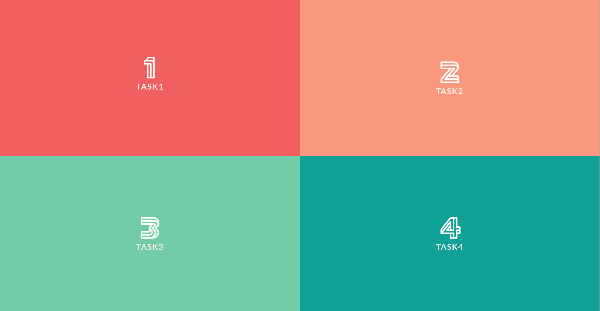

[TOC]

<div style=”page-break-after: always;”></div>

## 编辑器选择

### Visual Studio Code

官网：[Visual Studio Code - Code Editing. Redefined](https://code.visualstudio.com/)

下载：


<center style="font-size:14px;color:#C0C0C0;">图1 VScode下载页面</center> 

快捷键：

1. 文件和编辑器操作：

- `Ctrl + N`：新建文件
- `Ctrl + O`：打开文件
- `Ctrl + S`：保存文件
- `Ctrl + Shift + S`：另存为
- `Ctrl + W`：关闭当前编辑器
- `Ctrl + Shift + T`：重新打开关闭的编辑器
- `Ctrl + P`：打开文件搜索框
- `Ctrl + Shift + F`：全局搜索
- `Ctrl + F`：在当前文件中搜索
- `Ctrl + Shift + H`：在当前文件中替换

2. 光标和选择操作：

- `Ctrl + ↑ / ↓`：向上 / 下移动一行
- `Ctrl + ← / →`：向左 / 右移动一个单词
- `Ctrl + Shift + ↑ / ↓`：向上 / 下选择多行
- `Ctrl + Shift + ← / →`：向左 / 右选择一个单词
- `Shift + Alt + ↑ / ↓`：向上 / 下复制一行
- `Shift + Alt + ← / →`：将当前行左 / 右缩进

3. 调试和运行操作：

- `F5`：启动调试
- `F9`：在当前行设置 / 取消断点
- `F10`：逐过程执行代码
- `F11`：逐语句执行代码
- `F12`：转到定义

4. 其他常用操作：

- `Ctrl + Shift + E`：打开侧边栏
- `Ctrl + Shift + G`：打开Git面板
- `Ctrl +``   ` ：打开终端
- `Ctrl + K, Ctrl + S`：打开键盘快捷键帮助文档

配置：

<center class="half">
       
    
    
</center>

<center style="font-size:12px;color:#C0C0C0;">图2 VScode下载前端插件</center> 

实习中，段文豪和张梓元用的是`VsCode`，熟悉常用的快捷键和设置方法。


### Sublime Text

官网：[Sublime Text - Text Editing, Done Right](https://www.sublimetext.com/)

下载：


<center style="font-size:12px;color:#C0C0C0;">图3 Sublime Text下载地址</center> 

   快捷键：

1. 基本编辑操作

- `Ctrl + Z`：撤销上一次编辑操作
- `Ctrl + Shift + Z`：重做上一次被撤销的操作
- `Ctrl + X`：剪切所选内容
- `Ctrl + C`：复制所选内容
- `Ctrl + V`：粘贴剪贴板中的内容
- `Ctrl + A`：全选文本
- `Ctrl + Shift + K`：删除当前行
- `Ctrl + Shift + L`：同时选中文本中出现的所有匹配项

2. 光标移动

- `Ctrl + ←/→`：将光标移动到当前单词的开头或结尾
- `Ctrl + Shift + ←/→`：将当前行的文本向左或向右缩进
- `Ctrl + Shift + ↑/↓`：将当前行上移或下移

3. 搜索和替换

- `Ctrl + F`：打开搜索框
- `Ctrl + Shift + F`：打开全局搜索框
- `Ctrl + H`：打开搜索并替换框

4. 文件操作

- `Ctrl + N`：新建文件
- `Ctrl + O`：打开文件
- `Ctrl + S`：保存当前文件
- `Ctrl + Shift + S`：另存为当前文件
- `Ctrl + W`：关闭当前文件

实习中，殷鹏成和朱柏冰使用的是Sublime Text。

## 第三方库使用

### `JQuery`
`JQuery`是一个快速、小巧、功能丰富的`JavaScript`库。它使`HTML`文档的遍历和操作、事件处理、动画和`Ajax`等事情变得更加简单，它有一个易于使用的API，可以在众多的浏览器上使用。凭借多功能性和可扩展性的结合，`JQuery`已经改变了数百万人编写JavaScript的方式。官网:[JQuery官网](https://jquery.com/)

```javascript
$(document).ready(function(){
  $("p").click(function(){
    $(this).hide();
  });
});

```

### `Modernizr`

`Modernizr`可用于响应用户的浏览器功能，`Modernizr`告诉你用户的浏览器可以提供哪些`HTML`、`CSS`和`JavaScript`功能。

`Modernizr`是一组超快的测试-或者称之为 "检测"-在你的网页加载时运行，然后你可以使用测试结果来为用户定制体验。所有网络开发者都会遇到浏览器和设备之间的差异。这主要是由于不同的功能集：最新版本的流行浏览器可以做一些旧版浏览器做不到的很棒的事情--但我们仍然要支持旧版浏览器。`Modernizr`使得提供分层体验变得很容易：在支持这些功能的浏览器中使用最新和最伟大的功能，而不至于让不那么幸运的用户感到无奈。

### `Openlayers`


### `TweenMax`

`TweenMax`是GreenSock Animation Platform(GSAP)动画平台核心文件。`TweenMax.js`集成了`GreenSock`动画平台的大部分核心功能,且具有极高的兼容性。相较于[Animate.css](https://animate.style/)，这个插件封装的的确很好，但在做一些缓动方面的动画，它也有一定的不足之处。`TweenMax`更方便，更快速，更清亮与模块化，灵活控制，不受限于线性序列，可以重叠动画序列。

### `Normalize.css`

`Normalize.css`是一个很小的`CSS`文件，它默认的HTML元素样式上提供了跨浏览器的高度一致性，相比传统的`CSS reset`，`Normalize.css`是一种现代的、为`HTML5`准备的优质替代方案。

`Normalize.css`官网地址：https://necolas.github.io/normalize.css/

### `swiper.js`

`Swiper`常用于移动端网站的内容触摸滑动，`Swiper`是纯`javascript`打造的滑动特效插件，面向手机、平板电脑等移动终端。`Swiper`能实现触屏焦点图、触屏Tab切换、触屏轮播图切换等常用效果。

### `model-viewer`

`<model-viewer>`是一个 Web 组件，使渲染交互式 3D 模型 - 可选在 AR 中 - 易于操作，在尽可能多的浏览器和设备上。 `<model-viewer>`努力为您提供出色的渲染质量默认值，并提高性能。

### ` highlight.js`

`highlight.js `是一款使用 `javascript` 开发代码高亮工具库，能够让网页上的代码显示接近我们使用的代码编辑器的高亮样式，从而看起来更舒服，增强阅读体验。

`highlight.js`支持 197 种开发语言和 246 种代码高亮风格主题；自动开发语言检测；支持多种语言混合代码同时高亮；支持任何 HTML 标签，不仅仅是<code></code>；支持 `npm `安装，可以在 `Vue.js` 中使用，也可以在` node.js` 中使用；无依赖，与任何 js 框架兼容。

## 主页设计

### 设计参考

主要界面设计来自[Fullscreen Layout Page Transitions - Pure JS/CSS (codepen.io)](https://codepen.io/marcelo-ribeiro/pen/xOOKpO)。将主页面分成四部分，每部分可描述一次实习。



<center style="font-size:12px;color:#C0C0C0;">图4 主页</center> 

这样的布局设计叫做`boxlayout`(箱式布局)，很适合多个独立的任务设计与多层内容描述。

### 设计细节

在根目录下的`js`文件夹和`css`文件夹中，分别有`boxlayout.js`和`component.css`。这两个文件控制了整体的布局和跳转。

```css
.bl-main > section {
	position: absolute;
	width: 50%;
	height: 50%;
}

.bl-main > section:first-child {
	top: 0;
	left: 0;
	background: #F06060;
}

.bl-main > section:nth-child(2) {
	top: 0;
	left: 50%;
	background: #FA987D;
}

.bl-main > section:nth-child(3) {
	top: 50%;
	left: 0;
	background: #72CCA7;
}

.bl-main > section:nth-child(4) {
	top: 50%;
	left: 50%;
	background: #10A296;
}
```

上述代码，是控制四个`box`入口的样式，四个section分别占据左上、右上、左下、右下，分别对应Task1， Task2， Task3， Task4。

```javascript
$section.on( 'click', function() {
    console.log('open')
    if( !$section.data( 'open' ) ) {
        $section.data( 'open', true ).addClass( 'bl-expand bl-expand-top' );
        $el.addClass( 'bl-expand-item' );	
    }
} ).find( 'span.bl-icon-close' ).on( 'click', function() {
    $section.data( 'open', false ).removeClass( 'bl-expand' ).on( transEndEventName, function( event ) {
        if( !$( event.target ).is( 'section' ) ) return false;
        $( this ).off( transEndEventName ).removeClass( 'bl-expand-top' );
    } );

    if( !supportTransitions ) {
        $section.removeClass( 'bl-expand-top' );
    }

    $el.removeClass( 'bl-expand-item' );

    return false;
} );
```

上述代码绑定和监听点击事件，控制页面跳转。

当然上述代码只是部分内容的，完整的控制需要全部代码发挥作用。这里大部分是根据参考提供的，进行了少部分调整。

## Task1

通过`github page`，可以访问我们的网站，但由于`github`的网络问题，不能访问天地图。地址：[互联网与移动GIS开发任务作业 (dwh553321494.github.io)](https://dwh553321494.github.io/webgis_task/)

实习已经部署到了服务器上面，域名尚未通过，现阶段只能通过公网ip访问：[互联网与移动GIS开发任务作业](http://47.92.251.195:8080/)

项目`github`仓库地址：[dwh553321494/webgis_task (github.com)](https://github.com/dwh553321494/webgis_task)

### 整体的导航设计


<center style="font-size:12px;color:#C0C0C0;">图5 实习一主页</center> 

一个二级标题的Task1，加一段p标签，对实习一内容进行简单介绍。

下面的四个图片分别对应每个人主页的入口。点击图片即可查看每个人的个人主页。

### 段文豪部分

#### 文件结构

```python
./DWH
│  index.html				# 主页
│  test.html				# openlayers示例
├─css
│      code.css				# code框的样式
│      mySwiper.css		     # 滑轮轴的样式
│      nva.css				# 导航栏的样式
│      
├─imgs					    # 存放的图片
│      cute.JPG
│      good.JPG
│      jquery.png
│      life.JPG
│      swiper.jpg
│      tool.glb
│      TweenMax.svg
│      夕阳.JPG
│      太阳.glb
│      
└─js						# js文件
        mySwiper.js			  # 滑轮轴的事件监听js文件
        nav.js			      # 导航栏的事件监听js文件
```

#### 个人主页展示

（1）顶部


<center style="font-size:12px;color:#C0C0C0;">图6 段文豪主页</center> 

这里是顶部展示，主要是一个太阳三维模型加一主标题和一副标题。箭头指向后续内容。

太阳模型来自：[iconfont-阿里巴巴矢量图标库](https://www.iconfont.cn/illustrations_3d/detail?spm=a313x.7781069.1998910419.d9df05512&cid=44075)

（2）个人介绍


<center style="font-size:12px;color:#C0C0C0;">图7 段文豪个人介绍</center> 

随着滚轮的滚动，个人介绍和导航栏会展示出来。

这个设计想法是看了很多卡片设计之后想出来的，配色是参考[免费的渐变背景CSS3样式 | oulu.me](http://color.oulu.me/)。然后加上滚轮，就可以加入自己任意想加的内容，我这里加了三个。

<center class="half">
    
    
    
</center>

<center style="font-size:12px;color:#C0C0C0;">图8 段文豪个人介绍主要内容</center> 

1. 第一个是我的一个自我介绍，图片是这个月去东湖拍的，刚好碰上日落。
    点击知乎主页，可以跳转到我的知乎个人主页。


<center style="font-size:12px;color:#C0C0C0;">图9 段文豪知乎主页</center> 

2. 第二个是关于我目前的专业学习。图片很好的诠释了目前的学习生活状态，每天差不多就是这么几步。
    
    点击GitHub主页可以跳转到我的github个人主页，虽里面没啥东西。
    

<center style="font-size:12px;color:#C0C0C0;">图10 段文豪GitHub主页</center> 

3. 第三个是未来的打算，目前现阶段最主要目标就是升学了，最近捣鼓比较多的还是前端，只不过偏向于一些设计方面的了，感觉不能就简单的添加一些控件就行，要注重流畅和方便。研究生期间想要继续研究遥感智能解译相关的算法，期待早日开发出一款属于遥感的GPT！
   图片选自动漫《排球少年！！》，这个少年的发色跟背景图颜色一样！

（3）json格式解读


<center style="font-size:12px;color:#C0C0C0;">图11 json格式介绍</center> 

这里没有说从本地请求一个json文件，而是解释一下json格式和举了一个例子。关于json格式常用于前后端的交互，在WebGIS中有另一常见的传输格式--GeoJson。其与普通的json区别就是以特定的结构储存地理信息，但结构上与json格式保持一致，同样也是键值对。其可直接由一些地理GIS库进行解读，而其实以传统json格式记录地理信息，同样也可以用于地理信息的传输。

而传输时的工具常用的是`ajax`，其封装好了请求方法，例如`get`、`post`、`delete`等。在vue中，用axios可以很方便的进行二次封装，很方便地可以用在前后端分离的项目中。

（4）openlayers体验


<center style="font-size:12px;color:#C0C0C0;">图12 OpenLayers和天地图</center> 

这里简单地用`openlayers`调用了一次天地图。后面的实习中可能也主要依据`openlayers`实现一些有意思的`gis`操作。

（5）技术介绍


<center style="font-size:12px;color:#C0C0C0;">图13 技术介绍</center> 

这一些就是我这次实习用的一些js库，均为`cdn`引入，如果为本地浏览文件，可能无法发送请求。

```html
<script src="https://cdnjs.cloudflare.com/ajax/libs/gsap/2.0.1/TweenMax.min.js"></script>
<script type="module" src="https://unpkg.com/@google/model-viewer/dist/model-viewer.min.js"></script>
<script src="https://cdnjs.cloudflare.com/ajax/libs/jquery/3.3.1/jquery.min.js"></script>
<script src="https://cdnjs.cloudflare.com/ajax/libs/Swiper/4.3.5/js/swiper.min.js"></script>
<link rel="stylesheet" href="https://cdnjs.cloudflare.com/ajax/libs/normalize/5.0.0/normalize.min.css"/>
<link rel="stylesheet" href="https://cdnjs.cloudflare.com/ajax/libs/Swiper/4.3.5/css/swiper.min.css"/>
```

（6）footer部分


<center style="font-size:12px;color:#C0C0C0;">图14 footer部分</center> 

阐述本次实习参考网页，和后续目标。希望在后面的学习中有更多的思考和感悟。

#### 遇到的问题

1. 插入的`html`的滚轮隐藏问题。

在`iframe`中提供一个属性`frameborder`用于隐藏边框，同样也提供一个属性`scrolling`用于控制滚动条的显示，但在实际中这个属性发挥的作用是隐藏了滚动条，但不允许滚动`iframe`插入的`html`的内容。

后面查询资料，只要在html中把滚动条隐藏即可。

```css
body::-webkit-scrollbar {
    display: none;
}
```

2. 一个在`css`上的bug

在使用我的导航栏时，在点击完后，整体的页面均往上移，尚未解决。


<center style="font-size:12px;color:#C0C0C0;">图15 bug</center> 

###  殷鹏成部分

####  文件结构

```txt
│  index.html
└─assets
    ├─css
    │      block.css
    │      iconfont.css
    │      onlinewebfonts.css
    │      style.css
    │      vn.css
    │      vno.css
    │      
    ├─fonts     
    ├─highlight             
    ├─img
    │      1.jpg     
    ├─js
    │      bing.js
    │      jquery.min.js
    │      main.js
    └─json
            images.json

```

#### 个人介绍页面设计

（1）点击task1的第二个窗口进入殷鹏成的个人介绍页面，进入时，元素会以跳跃方式渲染。页面中所有元素居中，从上到下依次为头像、姓名、爱好、专业学习、个性签名、任务跳转按钮、个人网站。

                

<center style="font-size:12px;color:#C0C0C0;">图16 殷鹏成主页</center> 

鼠标覆盖在头像上会进行图片旋转，展示出底部的姓名，ypc经过字体渲染。

 

<center style="font-size:12px;color:#C0C0C0;">图17 殷鹏成动画特效</center> 

（2）背景图片与个性签名每次刷新时都会改变。刷新后，网页使用`jQuery`将从`bing`壁纸网站中获取背景图片`URL`并添加到`div`的`css`中，同时还会使用`jQuery`从一言数据中获取个性签名添加到`<p>`中。

<center class="half">
    
    
    
    
</center>

<center style="font-size:12px;color:#C0C0C0;">图18 背景更换</center> c

（3）点击最下方按钮，跳至我个人的`GitHub`、知乎、邮箱页面。

<center class="half">
    
    
</center>

<center style="font-size:12px;color:#C0C0C0;">图19 殷鹏成的知乎和github</center> 

（4）`Json`数据格式解读

倒数第二行四个按钮对应的就是每次实习，滑动页面或者点击`Json`跳至`json`解读模块。该模块中使用了`highlight.js`实现代码高亮显示，在代码框中滑动观察。

 

<center style="font-size:12px;color:#C0C0C0;">图20 json格式</center> 

（5）后续的canvas、地图留给后面的作业。

###  朱柏冰部分

####  文件结构

```txt
./ZBB
│  tree.txt
│  名侦探柯南.mp3
│  实习1.html
├─css
│      style.css
└─images
        毛利兰.jpg
```

####  页面展示


<center style="font-size:12px;color:#C0C0C0;">图21 朱柏冰主页</center> 

点击家乡湖北省十堰市，即可跳转至十堰市官方网站。


<center style="font-size:12px;color:#C0C0C0;">图22 十堰市官网网站</center> 

点击播放按钮，即可播放音频！


<center style="font-size:12px;color:#C0C0C0;">图23 音乐播放器</center> 

除此之外，还可以调节进度、音量大小、播放倍速和下载。

###  张梓元部分

####  文件结构

```txt
./ZZY
│  jquery.js
│  tree.txt
│  zzy.html
│  zzyInform.json
└─image
        人物.jpg
```

####  页面展示

自我介绍页面效果如下：


<center style="font-size:12px;color:#C0C0C0;">图24 张梓元主页</center> 

####  实现细节

该自我介绍页面内容部分包括两部分：`profile-card-header`和`profile-card-about`。`profile-card-header`是上半部分，其中有``标签的头像、`<h1>`标签的姓名和地址。`profile-card-about`是下半部分，其中个人简介的详细内容是无序列表`<ul>`。代码结构如下：

```html
<div class="side_wrapper">
	<div class="about-dev">
        <div class="profile-card_header" ></ div>
        <div class="profile-card_about"></div>
	</div>
</ div>
```

`profile-card-about`列表中的数据使用`ajax`发送请求获取本地`json`格式数据，并用`JavaScript`解析后动态创建`<li>`标签并将渲染至页面。

```javascript
window.onload = function(i
    $.ajax({
            url: "./zzyInform.json",type: "get",
            dataType: "json",
            success: function(data){
            renderData(data)
        },
        error: function(msg)f
            alert( "ajax连接异常:"+msg);
        }
    });
};

```

```javascript
function renderData(data){
    console.log(data)
    document.getElementById("name").innerHTML=data.name;
    document.getElementById("address").innerHTML=data.address;
    var myul = document.getE1ementById("personal-inform");
    myul.innerHTML = “<li class='inform-li'>"+""年龄: ".bold().fontsize(4)+"&nbsp;"data.agar*"/span+"</li>"
    +"</li>": .boLa().fontsize(4)+&nbsp; "+data.hoblys"</spany"+"<li class='inform-li'>""+学校:".bold() .fontsize(4)+&nbsp;"rdta.schol+"c/spanb“+"</li>"
    +"<li class= 'inform-li'>"+”专业: ".bold( ).fontsize(4)+&nbsp;"+data.specialty*k/span>"+"</1i>"
    +"<li class='inform-li'>""+"名言:".bold().fontsize(4)+&nbsp;""+data.wisdomt"</span>“+"</li>"
}
```

## 辅助功能

###  代码管理

本次实习通过`github`进行代码版本管理。

`git`的小组学习笔记见：https://froghao.notion.site/git-a8de44b5ede742c1af6842c03068c901

本次实习的仓库见：[dwh553321494/webgis_task (github.com)](https://github.com/dwh553321494/webgis_task)

###  文档编写

本次文档编写全部均有`markdown`格式撰写，通过`typora`软件导出为`pdf`，主题为`typora-latex-theme`。

###  小组分工

| 成员   | 分工                                       |
| ------ | ------------------------------------------ |
| 段文豪 | 小组组长，文档合并，主界面管理             |
| 殷鹏成 | 学习新的编辑器和前端知识                   |
| 张梓元 | 完成个人任务，帮助小组其他成员完成个人主页 |
| 朱柏冰 | 学习新的编辑器，学习前端代码               |


