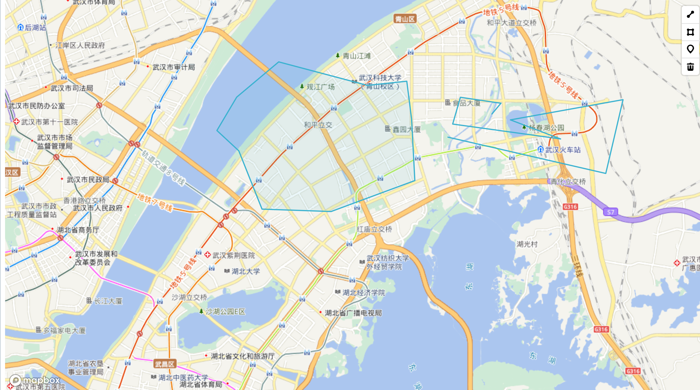
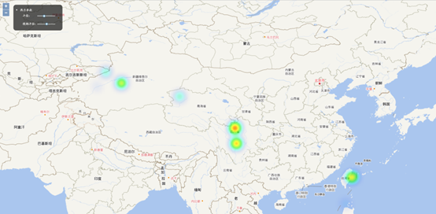
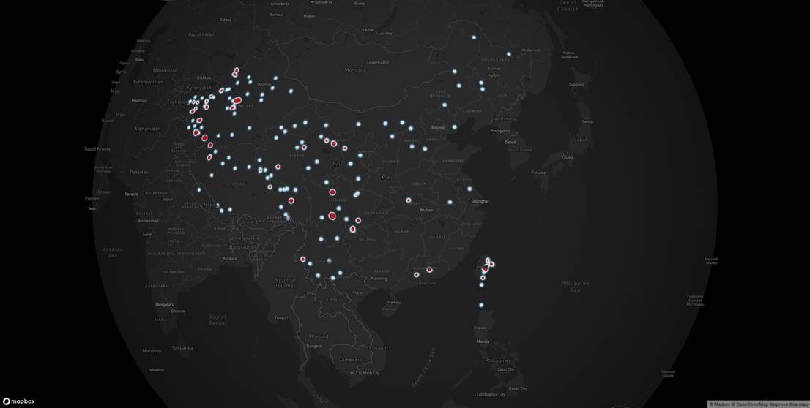

[toc]

<div style=”page-break-after: always;”></div>


##  实习任务

1. 继续配置前端开发环境
   1. 下载`JQuery`和`OpenLayers`；
   2. 安装配置`NodeJS`开发环境
   3. 运行`OpenLayers`示例
2. 自选设计内容：小组成员学习使用`OpenLayers`和`MapBox`两种不同的`WebGIS`框架
3. 基于`Canvas`绘制小组图标

##  第三方库使用

###  `openlayers`

​        `openlayers `是一种用于 Web 地图开发的 JavaScript 库。它提供了一组丰富的 `API`，使得开发者能够在网页中添加地图、图层和交互元素，以及与地图进行交互。

`openlayers `支持众多的地图数据源和格式，包括 `Google Maps`、`Bing Maps`、`OpenStreetMap`、`WMS`、`WFS`、`KML`、`GeoJSON `等。它还支持多种投影方式，如 `Web Mercator`、`EPSG:4326`、`EPSG:3857` 等。

​      	通过 `openlayers`，开发者可以轻松地实现地图的可视化、搜索、标注、缩放、平移、旋转、测量等功能。同时，`openlayers `还支持自定义图层和控件，使得开发者可以根据自己的需求进行定制化开发。

​		总之，`openlayers `是一个功能强大、易用性高的 Web 地图开发库，适用于各种类型的地图应用程序。

​		官方网址：[OpenLayers - Welcome](https://openlayers.org/)

### `mapbox`

​        ` Mapbox GL JS` 是他们的一个开源客户端库，用于渲染 Web 端的可交互地图。作为 `Mapbox `生态系统的一部分，它通常与 `Mapbox `提供的其他服务集成在一起，统一对外使用。目前 `Mapbox `公司的主营业务除了地图相关产品，还包括 LBS(Location Based Services)服务、自动驾驶、自有数据(Boundaries, Traffic Data, Movement)以及车机服务。`Mapbox GL JS` 是一个 JavaScript 库，它使用 `WebGL `技术，以vector tiles方式数据组织，以`Mapbox styles`来配置地图样式规则，最终渲染得到交互式地图。`Mapbox GL` 生态系统的另一部分是`Mapbox Mobile`，它是一个用 C++ 编写的兼容桌面和移动平台的渲染引擎。

​		官方网址：[Mapbox GL JS | Mapbox](https://docs.mapbox.com/mapbox-gl-js/guides/)

###  `dat.gui`

​		`dat.gui` 是一个用于创建交互式调试界面的JavaScript库。它允许开发者轻松地创建自定义控件和面板来控制代码中的变量和参数，以方便开发者在调试过程中进行实时调整和查看。

​		`dat.gui` 最初由 Google 开发并由其开源，现在已经成为一个非常流行的开源项目。它提供了一组易于使用的`API`，可以用于创建各种类型的控件，包括滑块、复选框、文本框等等。开发者可以将这些控件组合在一起，创建一个自定义的面板，以便他们可以控制和监视代码中的变量和参数。

​		`dat.gui `还具有良好的可定制性，开发者可以自定义面板的外观和行为，以适应不同的应用场景。此外，它还支持多语言和适应不同的设备屏幕大小。

​		在Web开发、数据可视化和游戏开发等领域，`dat.gui `都是非常受欢迎的工具之一。它简单易用，功能强大，为开发者提供了一个快速、方便的调试界面。

​		官方网址：[dataarts/dat.gui: Lightweight controller library for JavaScript. (github.com)](https://github.com/dataarts/dat.gui)

##  TASK 2

###  总体设计

####  导航栏

​        本次实习我们将内容合并到了一起，没有区分个人内容。在总的页面中通过可隐藏的导航栏设计结构，可以定位至每个人完成的内容。

```javascript
var menuToggle = document.querySelector('[data-js="menu-toggle"]');

var interval = setInterval(function() {
  menuToggle.click();
}, 2000);

document.body.addEventListener('click', function () {
   clearInterval(interval);
});

menuToggle.addEventListener('click', function () {
  document.body.classList.toggle('panel-open');
  menuToggle.classList.toggle('open');
});

var closePanel = document.querySelector('[data-js="hidden-panel-close"]');

closePanel.addEventListener('click', function () {
  document.body.classList.remove('panel-open');
  menuToggle.classList.remove('open');
});
```

​	上述代码是侧边导航栏的`js`代码，主要任务是侧边栏`dom`对象的监听事件处理。`menuToggle`和`closePanel`分别是打开侧边栏和关闭侧边栏的对象 。

```css
.hidden-panel {
    background: #333;
    color: #666;
    font-size: 0.875rem;
    height: 100%;
    position: absolute;
    right: -250px;
    top: 0;
    width: 250px;
}

.hidden-panel a {
    color: #999;
    transition: color 0.3s ease-out;
}

.hidden-panel a:hover {
    color: #fff;
}

.hidden-panel-close {
    color: #666;
    cursor: pointer;
    position: absolute;
    right: 20px;
    top: 3.7em;
    transition: color 0.3s ease-in-out;
}

.hidden-panel-close:hover {
    color: #fff;
}

.hidden-panel-content {
    padding: 3.65em 10%;
}

.hidden-panel-nav {
    border-bottom: 1px solid #666;
    border-bottom: 1px solid rgba(102, 102, 102, 0.25);
    margin-bottom: 1.5em;
    padding-bottom: 1.5em;
    text-transform: uppercase;
}

.hidden-panel-nav h3 {
    letter-spacing: 1px;
    margin-bottom: 1em;
}

.hidden-panel-nav ul {
    list-style: none;
    font-weight: 600;
    margin: 0;
    padding: 0;
}

.hidden-panel-nav li {
    padding: 0.25em 0;
}
```

导航栏的样式代码。主要通过`css`来控制侧边栏的展示和隐藏。


<center style="font-size:15px;color:#000000;">图1 导航栏设计</center> 

####  版面设计

​		整体采取段文豪实习一的架构，以粒子文字作为首先展示内容，代表小组的特色风格。各自内容按不同背景色分割开，主要风格仍是暖色调。内容采取对比形式。`canvas`与`svg`对比，`openlayers`和`MapBox`的绘制对比与空间可视化--热力图对比


<center class="half">
       
    
    
    
</center>

<center style="font-size:15px;color:#000000;">图2 实习二总览</center> 

###  段文豪

####  文件结构

```python
.
│  index.html 	# index
│  tree.txt
└─js
   map.js		# mapbox调用文件
```

####  粒子文字

```javascript
// 粒子类
class Particle {
    constructor(canvas, context, x, y) {
        this.canvas = canvas;
        this.context = context;
        this.x = x;
        this.y = y;
        this.radius = particleDensity / 2;        
        this.spring = {
            x: x, y: y
        };
        this.dX = 0;           
        this.dY = 0;
    }

    getDistanceTo(x, y){
        let dX = x - this.x,
            dY = y - this.y;
        return {
            x: dX, y: dY,
            dist: Math.sqrt(dX * dX + dY * dY)
        };
    }

    repulseTo(x, y){
        let distance = this.getDistanceTo(x, y),
            repulseAngle = Math.atan2(distance.y, distance.x),
            repulseForce = (-1 * Math.pow(mousePower, 2)) / distance.dist;

        this.dX += Math.cos(repulseAngle) * repulseForce;
        this.dY += Math.sin(repulseAngle) * repulseForce;        
    }

    springTo(){
        this.dX += (this.spring.x - this.x) * particleStiffness;
        this.dY += (this.spring.y - this.y) * particleStiffness;        
    }

    update(){
        this.springTo();

        this.dX *= particleFriction;
        this.dY *= particleFriction;

        this.x += this.dX;
        this.y += this.dY;
    }

    draw(){ 
        this.context.fillStyle = 'white';

        this.context.beginPath();
        this.context.arc(this.x, this.y, this.radius, 0, Math.PI * 2, false);
        this.context.fill();        
    }
}
```

上述代码是粒子的类封装，其基于`canvas`绘制。一些物理原理和角度设计参考了网络资料。

```javascript
var fps = 60,
    interval = 1000 / fps,
    lastTime = (new Date()).getTime(),
    currentTime = 0,
    delta = 0;

var mouseX = 0, mouseY = 0,
    mouseRadius = 75,
    mousePower = 15,
    particleDensity = 10,
    particleStiffness = 0.15,
    particleOffset = 0,
    particleFriction = 0.9,
    particles = [],
    text = 'WebGIS小组',
    isPopulated = false;
```

其中`fps`代表刷新率、`interval`表示间隔、`mouseX`和`mouseY`表示鼠标位置、`mouseRadius`表示鼠标可波及范围、`mousePower`表示鼠标力度、`particleDensity`表示粒子密度、`particleStiffness`表示粒子刚度（即柔韧性）、`particleFriction`表示粒子摩擦系数、text为要展示的文本。

```javascript
function createParticle(x, y) {
    particles.push(new Particle(canvas, context, x, y));
}

function convertTextToParticle() {    
    context.save();
    context.fillStyle = "#000000";
    context.font = "Bold 200px Arial";
    let textSize = context.measureText(text),
        textHeight = 75;
    context.translate((canvas.width / 2) - (textSize.width / 2), canvas.height / 2);
    context.fillText(text, 0, textHeight);
    context.restore();    

    let image = context.getImageData(0, 0, canvas.width, canvas.height);
    particles = [];
    for(var y = 0; y < canvas.height; y += particleDensity) {
        for(var x = 0; x < canvas.width; x += particleDensity) {
            let opacity = image.data[((x + (y * canvas.width)) * 4 + 3)];
            if(opacity > 0) {
                createParticle(x, y);
            }
        }
    }    

    isPopulated = true;
}
```

这里的代码将文本转换为粒子效果。然后配合渲染函数和绘画接口即可完成绘制。

```javascript
(function gui() {
    let gui = new dat.GUI();
  
    textGUI = gui.add(this, 'text').name('展示内容');
    textGUI.onChange(() => {  
      this.isPopulated = false;
    });

    let f1 = gui.addFolder('Mouse');
    f1.add(this, 'mouseRadius', 10, 100).name('半径');
    f1.add(this, 'mousePower', 5, 15).name('力度');  
    f1.open();
  
    let f2 = gui.addFolder('Particle');
    f2.add(this, 'particleStiffness', 0.1, 1).name('刚度');
    f2.add(this, 'particleFriction', 0.1, 0.95).name('摩擦度'); 
    f2.open();
  
})();
```

这里是`gui`部分代码，是通过`dat.gui`实现。很轻量级也很简单实现。其效果为下图。


<center style="font-size:15px;color:#000000;">图3 GUI界面</center> 

通过这个`gui`，可以完成一些简单的**动态交互**，例如更换展示内容、改变光标的范围和力度、改变粒子间的刚度和摩擦系数。

<center class="half">
    
    
    
    
    
    
</center>

<center style="font-size:15px;color:#000000;">图4 文字粒子示例</center> 

####  `Mapbox`实现交互绘制点线面

​		`MapBox`与`OpenLayers`同样是作为`Web`端进行`gis`可视化的工具。两者在逻辑上没有很大的区别，都是基于`source`、`layer`、`map`三个内容进行。但两者的`API`存在很大区别尤其是`mapbox`没有了要素的概念，`layer`的`api`也得到了隐藏，所以在代码层面还是有很大区别。小组秉持着老师的教学理念，组内要有不同的工具使用进行交流，来相互学习，所以我们组选择了`openlayers`和`mapbox`进行先验学习。后面的实习中，我们组每个人都学习了一个框架，用于展示不同产商各自的框架特点与代码编写难易程度。

​		在`MapBox`中除了现有的`API`之外，还有很多的拓展工具，其中就包含绘制的拓展`mapbox-gl-draw`。

> > Adds support for drawing and editing features on `Mapbox GL JS `maps.
> >
> > `github`仓库：https://github.com/mapbox/mapbox-gl-draw

有了这个工具就很容易实现画点线面的功能了。

引入方式：

```html
<script src='https://api.mapbox.com/mapbox-gl-js/v2.13.0/mapbox-gl.js'></script>
    <script src="https://api.mapbox.com/mapbox-gl-js/plugins/mapbox-gl-draw/v1.4.0/mapbox-gl-draw.js"></script>
    <link rel="stylesheet" href="https://api.mapbox.com/mapbox-gl-js/plugins/mapbox-gl-draw/v1.4.0/mapbox-gl-draw.css" type="text/css">
    <link href='https://api.mapbox.com/mapbox-gl-js/v2.13.0/mapbox-gl.css' rel='stylesheet' />
```

绘制控件加入:

```javascript
const draw = new MapboxDraw({
    displayControlsDefault: false,
    controls: {
            point: true,
            line_string: true,
            polygon: true,
            trash: true
        },
    });
map.addControl(draw);
```

即可在地图右上角加入绘制控件。这个控件可以自定义设计，在之后的实习中，可以实现更改绘制样式的设定！


<center style="font-size:15px;color:#000000;">图5 mapbox绘制点线面</center> 

且这个拓展绘制出的几何要素可以点击进行更改，可以更换位置、添加新的点位置。

<center>
    
    
</center>

<center style="font-size:15px;color:#000000;">图6 更改位置和形状</center> 

###  殷鹏成

####  热力图介绍

​		在GIS中，热力图（Heatmap）是一种基于空间数据的可视化方式，它通过对数据点的密度进行统计和分析，将空间数据的密度信息以不同的颜色或强度进行显示，以展示不同区域的数据密度分布情况。

​		热力图的生成通常需要两个关键的要素：空间位置和权重值。空间位置表示数据点在地理空间中的位置，通常使用经纬度坐标来表示；权重值表示数据点的密度或强度，通常使用某个指标（如数量、频率、密度等）来度量。

​		热力图可以帮助人们更直观地理解空间数据的分布规律和趋势，以及不同区域之间的差异。它广泛应用于许多领域，如城市规划、环境监测、交通分析、地震预警、商业分析等。

####  数据源选择与制作

​		选择中国近一年来的3.0以上的地震，将其记录在Excel表格中，在`QGIS`中，打开，添加`XY`字段，导出成`GeoJson`文件。


<center style="font-size:15px;color:#000000;">图7 地震数据预览</center> 

用`python`将`GeoJson`文件读取处理成可处理的地震`json`数据，每个震级包含所有的坐标数组与权重，以供后续显示热力图使用。

#### `openlayers`热力图

`OpenLayers`是一种流行的`JavaScript`地图库，可以用来实现`Web`地图的开发。`OpenLayers`中的热力图可以通过使用`ol.layer.Heatmap`图层来实现，具体步骤如下：

1. 导入`OpenLayers`库和`ol.layer.Heatmap`图层的依赖库;

2. 创建一个`OpenLayers`地图对象，并添加一个基础的天地图图层；

3. 创建一个`OpenLayers`地图对象，并添加一个基础图层，如下所示：

```javascript
var Heatmap = new ol.layer.Heatmap({
    source,
    blur,
    radius,
    gradient: ['#00f', '#0ff', '#0f0', '#ff0', '#f00'],
    weight:'weight'  //默认热力图层权值字段（0-1）
});

```

在上述代码中，创建了一个名为`heatmapLayer`的热力图层对象，其中：

+ `source`属性指定了热力图的数据源，可以是一个`VectorSource`对象，也可以是一个`TileWMS`对象等；
+ `blur`属性指定了热力图的模糊半径，即热力图效果的模糊程度；
+ `radius`属性指定了热力图的半径，即热力图效果的散射程度；
+ `gradient`属性指定了热力图的颜色渐变，可以是一个由多个颜色值组成的数组。

4. 在数据源中指定每个数据点的位置和权重值；

5. 最后，通过设置`ol.style.Style`对象的`image`属性为一个`ol.style.Circle`对象，将热力图点的样式设置为圆形，如下所示：

```javascript
var style = new ol.style.Style({
    image: new ol.style.Circle({
    radius: 5,
    fill: new ol.style.Fill({
    	color: 'rgba(255, 255, 255, 0.4)'	
    }),
    stroke: new ol.style.Stroke({
        color: 'rgba(0, 0, 0, 0.8)',
        width: 1
    })})
});

```

在上述代码中，创建了一个名为style的样式对象，其中：

+ `image`属性指定了热力图点的样式，即圆形；
+ `radius`属性指定了圆形的半径；
+ `fill`属性指定了圆形的填充色；
+ `stroke`属性指定了圆形的描边色和宽度。

最后，通过调用`heatmapLayer`对象的`setStyle`()方法将样式应用到热力图层中，设置出半径、模糊度的样式。完成上述步骤后，运行`Web`地图应用程序，即可在地图上看到生成的热力图。



<center style="font-size:15px;color:#000000;">图8 openlayers热力图</center> 

####  `MapBox`热力图

`Mapbox`也提供了创建热力图的`API`，下面是一个基本的示例：

1. 首先，需要创建一个`Mapbox`的地图实例，并指定地图的容器和access token；

```javascript
mapboxgl.accessToken = 'pk.eyJ1IjoieXBjOTk5IiwiYSI6ImNsZnd0bm1xYTBreHoza3FwNHgxcjdodHIifQ.ZM4uwFu_LpDbpwW8HRB7gQ';
const map = new mapboxgl.Map({
    container: 'map',
    style: 'mapbox://styles/mapbox/dark-v11',
    center: [113, 30],
    zoom: 3
});
```

2. 接下来，需要定义一个包含热力图数据的`GeoJSON`对象，这里直接用到我们得到的地震数据`GeoJson`数据；

3. 然后，使用`Mapbox`的热力图插件，创建一个热力图图层，并将其添加到地图中，如下所示：

```javascript
map.on('load', function () {
map.addSource('heatmap', {
    "type": "geojson",
    "data": data
});

map.addLayer({
    "id": "heatmap-layer",
    "type": "heatmap",
    "source": "heatmap",
    "maxzoom": 15,
    "paint": {
     "heatmap-intensity": [
	"interpolate",
        ["linear"],
        ["zoom"],
       0, 1,
       15, 3
      ],
      "heatmap-color": [
        "interpolate",
        ["linear"],
        ["heatmap-density"],
        0, "rgba(0, 0, 255, 0)",
        0.2, "royalblue",
        0.4, "cyan",
        0.6, "lime",
        0.8, "yellow",
        1, "red"
      ],
      "heatmap-radius": [
        "interpolate",
        ["linear"],
        ["zoom"],
        0, 2,
        15, 20
      ],
      "heatmap-opacity": [
        "interpolate",
        ["linear"],
        ["zoom"],
        7, 1,
        15, 0
      ]
    }
  });
});
```

在上述代码中，创建了一个名为`heatmap`的`GeoJSON`数据源，并将其添加到地图中。接着，创建了一个名为`heatmap-layer`的热力图图层，并将其类型设置为`heatmap`，指定数据源为`heatmap`。在热力图图层的paint属性中，通过设置不同的参数来控制热力图的颜色、半径、透明度等属性。例如：

+ `heatmap-color`：指定热力图的颜色
+ `heatmap-radius`：指定热力图的半径大小，同样使用`["interpolate", ["linear"], ...]`函数根据缩放级别来定义。
+ `heatmap-opacity`：指定热力图的透明度，同样使用`["interpolate", ["linear"], ...]`函数根据缩放级别来定义。

4. 最后，可以将热力图图层与其他图层进行叠加，例如在上述代码的末尾添加以下代码，将热力图图层置于`"waterway-label"`图层之下。



<center style="font-size:15px;color:#000000;">图9 mapbox热力图</center> 

###  张梓元

#### 雨伞绘制

```javascript
function drawUmbrella(id) {
            var canvas = document.getElementById(id);
            if (canvas == null)
                return false;
            var ctx = canvas.getContext('2d');
            ctx.beginPath();

            // 小雨点
            ctx.moveTo(47, 32);
            ctx.bezierCurveTo(40, 42, 38, 56, 46, 60);
            ctx.bezierCurveTo(64, 52, 50, 40, 47, 32);

            // 大雨点
            ctx.moveTo(78, 32);
            ctx.bezierCurveTo(70, 44, 62, 66, 78, 70);
            ctx.bezierCurveTo(104, 60, 80, 40, 78, 32);

            // 伞身
            ctx.moveTo(44, 118);
            ctx.bezierCurveTo(48, 114, 50, 90, 72, 76);
            ctx.bezierCurveTo(82, 82, 104, 70, 102, 54);
            ctx.bezierCurveTo(138, 26, 222, 76, 224, 118);
            ctx.lineTo(146, 118);
            ctx.lineTo(146, 200);

            ctx.bezierCurveTo(147, 212, 162, 216, 162, 192);
            ctx.bezierCurveTo(168, 188, 172, 186, 178, 192);
            ctx.bezierCurveTo(180, 200, 182, 218, 162, 231);
            ctx.bezierCurveTo(154, 240, 116, 226, 122, 200);

            ctx.lineTo(122, 118);
            ctx.lineTo(44, 118);
            ctx.fillStyle = 'rgb(26, 119, 189)'; // 设置画布填充颜色
            ctx.fillRect(0, 0, canvas.width, canvas.height); // 填充整个画布
            ctx.strokeStyle = "black"; //设置或返回用于笔触的颜色、渐变
            // ctx.stroke();
            ctx.globalCompositeOperation = 'destination-out';
            ctx.fillStyle = 'rgba(52, 152, 219, 1)';
            ctx.fill();
        }
```

####  图标绘制

```javascript
ctx.globalCompositeOperation = "destination-atop";
ctx.drawImage(img, 0, 0, c.width, c.height)
requestAnimationFrame(tick);
```

该图标用Adobe Illustrator 绘制，通过canvas加载在页面上。

####  动态波纹

```javascript
function draw(id) {
    var waveWidth = 400,
        offset = 0,
        waveHeight = 5,
        waveCount = 5,
        startX = -100,
        startY = 304,
        progress = 0,
        progressStep = 0.6,
        d2 = waveWidth / waveCount,
        d = d2 / 2,
        hd = d / 2;

    var c = document.getElementById(id);
    var ctx = c.getContext("2d");


    function tick() {
        offset -= 2;
        progress += progressStep;
        // 从下往上画
        if (progress > 320 || progress < 0) progressStep *= -1;

        if (-1 * offset === d2) offset = 0;
        ctx.clearRect(0, 0, c.width, c.height);

        ctx.beginPath();
        var offsetY = startY - progress;
        ctx.moveTo(startX - offset, offsetY);

        for (var i = 0; i < waveCount; i++) {
            var dx = i * d2;
            var offsetX = dx + startX - offset;

            ctx.quadraticCurveTo(offsetX + hd, offsetY + waveHeight, offsetX + d, offsetY);
            ctx.quadraticCurveTo(offsetX + hd + d, offsetY - waveHeight, offsetX + d2, offsetY);
        }


        ctx.lineTo(startX + waveWidth, 300);
        ctx.lineTo(startX, 300);
        ctx.fillStyle = "rgb(41, 171, 225)";
        ctx.fill();
        requestAnimationFrame(tick);

    }

    tick();

}
```

#### 效果

<center>
    
    
</center>

<center style="font-size:15px;color:#000000;">图10 canvas作图</center> 

波纹可以重复上下浮动。


###  朱柏冰

####  `OpenLayers`实现交互绘制点线面

将绘图功能封装到控件中，作为工具，更利于使用。首先确定实现该控件的所有需求：
（1）具有一个工具条，包含指针、绘点、绘线、绘面、绘圆、绘矩形、清空绘制这7个按钮；
（2）单击各个绘图按钮将切换至对应的绘图状态；
（3）单击指针按钮切换为非绘图状态；
（4）单击清空绘制清理掉所有已绘制的图形。

####  代码实现

（1）``ol.control.Control``类是`openlayers`中所有控件的基类，自定义绘图控件，以继承该类。
（2）定义按钮。
		定义`source_ `对象用于后续获取图层，定义`drawing_`对象用于后续实现交互绘制。定义按钮中指针、绘点、绘线、绘面、绘圆、绘矩形、清空功能的名称分别为`'None'`, `'Point'`, `'LineString'`,` 'Polygon'`, `'Circle'`,` 'Box'`, `'Clear'`利用`document.createElement('div')`生成一个`div`标签，设置各按钮的元素的`class`属性名称。

```javascript
    this.source_ = undefined;
    this.drawing_ = undefined;
    this.drawType = ['None', 'Point', 'LineString', 'Polygon', 'Circle', 'Box', 'Clear'];
    var defaultControlClassName = 'ol-unselectable ol-control';
    this.element = document.createElement('div');
    this.element.className = defaultControlClassName + ' ' + 'drawtools';
```

通过`document.createElement('button')`创建按钮，设置按钮的属性。

```javascript
    var createchildElement = function(options){
        var btn = document.createElement('button');
        btn.className = options.class;
        btn.id = options.id;
        var tipLable = 'Draw ' + options.value;
        btn.title = tipLable;
        btn.type = options.type;
        btn.value = options.value;
        return btn;
    };
```

为按钮与名称建立一一对应关系，设置按钮的样式。

```javascript
this.drawType.forEach(element => {
        var btn = createchildElement({
            type: 'button',
            class: 'drawBtn',
            value: element,
            id: 'ol-draw-' + element.toLocaleLowerCase()
        })
        btn.onclick = function(evt){
            evt.preventDefault();
            this.btnFouceChanged(evt);
            var value = evt.target.getAttribute('value');
            this.addInteraction(value);
        }.bind(this);
        this.element.appendChild(btn);
    });

    ol.control.Control.call(this, {
        element: this.element,
        target: opt_options.target
    })
```

通过`addInteraction`实现交互的绘图命令切换功能。

```javascript
ol.control.DrawControl.prototype.addInteraction = function(shapeType){
    this.initSource();
    if(shapeType !== 'None'){
        var geomFunc = undefined;
        if(shapeType === 'Clear'){
            this.source_.clear();
            return;
        }
        if(shapeType === 'Box') {
            shapeType = 'Circle'
            geomFunc = ol.interaction.Draw.createBox();
        }
        this.drawing_ = new ol.interaction.Draw({
            source: this.source_,
            type: shapeType,
            freehand: false,    //按住shift可以跟踪鼠标绘制
            geometryFunction: geomFunc
        });
        this.getMap().addInteraction(this.drawing_);
    }
}
```

（3）按钮样式
新建一个`css`文件来设定按钮的样式。
首先规定工具条的位置以及格式，令按钮纵向排列。

```javascript
.drawtools{
    top: .5em;
    right: 3em;
    display: flex;
}

```

然后为每个按钮插入图片作为标识

```css
#ol-draw-none{
    background: url(./img/pointer_16px.png) no-repeat;
}
#ol-draw-point{
    background: url(./img/point_16px.png) no-repeat;
}
#ol-draw-linestring{
    background: url(./img/linestring_16px.png) no-repeat;
}
#ol-draw-polygon{
    background: url(./img/polygon_16px.png) no-repeat;
}
#ol-draw-circle{
    background: url(./img/circle_16px.png) no-repeat;
}
#ol-draw-box{
    background: url(./img/box_16px.png) no-repeat;
}
#ol-draw-clear{
    background: url(./img/clear.png) no-repeat;
}
```

####  效果展示


<center style="font-size:15px;color:#000000;">图11 openlayers绘制点线面</center> 

上述图中，包含了点、线、多边形、矩形、圆的绘制。

##  总结

###  关于`Node`的使用

​		在前面四个实习中我们不打算使用`Node`、因为没有使用`Vue`等一些框架，我认为使用`Node`是不必要的，虽然可以简单使用`Vite`进行本地服务器和打包，但`VsCode`的插件`Live Server`为我们解决了这一问题。且Node的版本如果没控制好，有很多包是安装不了的，例如`sass`的`node-sass`和`sass-loader`。这是我们之间使用`vue`踩过的坑。后来`node`的版本就没敢装太高。小组成员已经都安装好了`node`，在后续大实习中使用。

###  `OpenLayers`和`MapBox`的总结

有着不同的实现方式和`API`接口，但它们也有许多使用相同点。以下是一些常见的使用相同点：

1. 地图容器：在各种`WebGIS`开发库中，地图通常被放置在一个特定的容器中，例如`HTML`的`div`元素或`Canvas`元素，可以通过设置该容器的尺寸和位置来控制地图的大小和位置。
2. 坐标系：大多数`WebGIS`开发库都支持不同的坐标系，例如经纬度坐标系和平面坐标系。通常可以通过`API`接口来实现不同坐标系的转换。
3. 图层管理：`WebGIS`开发库通常支持多种类型的图层，例如矢量图层、栅格图层、热力图层、标记图层等。这些图层可以通过`API`接口进行创建、添加、删除、编辑等操作。

4. 样式控制：在`WebGIS`开发库中，可以通过设置样式来控制地图和图层的外观，例如颜色、透明度、线宽、填充样式等。通常可以使用`CSS`样式表或`API`接口来实现样式控制。

5. 交互操作：`WebGIS`开发库通常支持各种交互操作，例如平移、缩放、旋转、鼠标停、单击、双击等。这些交互操作可以通过`API`接口进行配置和控制。

6. 数据格式：`WebGIS`开发库通常支持多种数据格式，例如`GeoJSON`、`WMS`、`WFS`、`KML`等。这些数据格式可以通过`API`接口进行读取、解析和转换。

虽然不同的`WebGIS`开发库有着不同的实现方式和`API`接口，但以上这些使用相同点可以让开发者更容易地在不同的`WebGIS`开发库之间切换和转换。

###  小组分工

| 成员   | 分工                                   |
| ------ | -------------------------------------- |
| 段文豪 | 主界面管理、`mapbox`使用、文字粒子绘制 |
| 殷鹏成 | `openlayers`和`mapbox`热力图绘制       |
| 张梓元 | 小组图标绘制、`canvas`绘图             |
| 朱柏冰 | `openlayers`使用，调用天地图和绘制     |

###  服务器更新

现已将实习二的代码上传至服务器和`github`。

`github`的网络问题，不能访问天地图。地址：[互联网与移动GIS开发任务作业 (dwh553321494.github.io)](https://dwh553321494.github.io/webgis_task/)。

实习已经部署到了服务器上面，域名尚未通过，现阶段只能通过公网`ip`访问：[互联网与移动GIS开发任务作业](http://47.92.251.195:8080/)。第一次访问需要等候一段事件，用于天地图请求响应。

