[toc]

## 实习任务

1. 选择一种公共地图资源，加载地图服务。

2. 设计地图控件（至少3种）。

3. 以实习一网页为基础，试着综合运用`Openlayers`中的动画效果（反弹、旋转、自旋、飞行、螺旋等），实现自己的小学>初中>高中>大学四个地点的动画跳转定位。

##  第三方库使用

###  OpenLayers

​     	`openlayers `是一种用于 Web 地图开发的 JavaScript 库。它提供了一组丰富的 `API`，使得开发者能够在网页中添加地图、图层和交互元素，以及与地图进行交互。

`openlayers `支持众多的地图数据源和格式，包括 `Google Maps`、`Bing Maps`、`OpenStreetMap`、`WMS`、`WFS`、`KML`、`GeoJSON `等。它还支持多种投影方式，如 `Web Mercator`、`EPSG:4326`、`EPSG:3857` 等。

​      	通过 `openlayers`，开发者可以轻松地实现地图的可视化、搜索、标注、缩放、平移、旋转、测量等功能。同时，`openlayers `还支持自定义图层和控件，使得开发者可以根据自己的需求进行定制化开发。

​		总之，`openlayers `是一个功能强大、易用性高的 Web 地图开发库，适用于各种类型的地图应用程序。

​		官方网址：[OpenLayers - Welcome](https://openlayers.org)

###  MapBox JS

` Mapbox GL JS` 是他们的一个开源客户端库，用于渲染 Web 端的可交互地图。作为 `Mapbox `生态系统的一部分，它通常与 `Mapbox `提供的其他服务集成在一起，统一对外使用。目前 `Mapbox `公司的主营业务除了地图相关产品，还包括 LBS(Location Based Services)服务、自动驾驶、自有数据(Boundaries, Traffic Data, Movement)以及车机服务。`Mapbox GL JS` 是一个 JavaScript 库，它使用 `WebGL `技术，以vector tiles方式数据组织，以`Mapbox styles`来配置地图样式规则，最终渲染得到交互式地图。`Mapbox GL` 生态系统的另一部分是`Mapbox Mobile`，它是一个用 C++ 编写的兼容桌面和移动平台的渲染引擎。

​		官方网址：[Mapbox GL JS | Mapbox](https://docs.mapbox.com/mapbox-gl-js/guides/)

###  ArcGIS API for JavaScript


###  Cesium

####  Cesium简介

​		`Cesium `是一个开源的 `JavaScript `库，用于创建高性能的 `3D `地球和地理空间应用程序。 它可以在任何现代的 `Web `浏览器中运行，并且支持多种数据源和格式，包括 `3D `模型、影像、 矢量数据、地形和实时数据流。`Cesium `基于 `WebGL `来渲染 `3D `图形，并且具有高度优化的 渲染引擎，使得大规模的 `3D `数据可视化成为可能。`Cesium `提供了一套丰富的 `API `和工具， 使得开发人员可以轻松地创建具有高级地理空间功能的应用程序。它支持多种地图投影和坐 标系，并且具有强大的地理空间分析和可视化功能，包括路径分析、可视域分析、`3D `测量 和地形分析等。`Cesium `还具有开放的插件架构，使得开发人员可以轻松地扩展其功能，并 集成其他第三方工具和数据源。另外，`Cesium `还提供了一些基于云的服务，如 `Cesium ion`， 可以帮助开发人员快速创建、托管和分享地理空间数据和应用程序。

####  Cesium 的数据类型

​		在 `Cesium `中，地理数据管理方式与 `Openlayers` 的要素（`Feature`）、数据源（`Source`）和 图层（`Layers`）模式不同，`Cesium `的要素主要由实体（`Entity`）构成，而实体又由图元（`Primitive`） 组成。`Primitive `是 `Cesium `中最基本的 `3D `几何形状，如点、线、多边形、模型等。它们可 以包含几何信息和材质信息，并且可以通过传递不同的几何和材质属性来渲染不同的 `3D `对 象。`Cesium `提供了许多不同类型的图元，包括 `Primitive`、`GroundPrimitive`、`Model`、`Billboard `等，可以根据需要选择合适的图元类型。Entity 是一种更高级别的对象，它可以具有各种属 性和行为，如位置、姿态、运动、标记、事件等。实体通常是由图元组成的，但它们还可以 包含其他附加信息和操作。例如，实体可以用于表示飞机、汽车、人、建筑物等物体，或者 用于表示传感器、摄像头、雷达等设备。通常情况下，`Entity `和 `Primitive `默认绑定在一个对 象上，也可以单独创建 `Primitive `显示，而不创建对应的 `Entity`。用户可以通过 `Entity `的接口 高效便捷设置要素的属性，也可以通过 `Primitive `精细控制对象的每个部分，甚至自己编写 `GLSL `来控制着色器。 除了 `Primitive `和 `Entity`，`Cesium` 还包括加载不同数据类型的重要类与接口，分别为：

（1）`DataSource`

 `DataSource `是一种表示地理空间数据的概念，它可以包含多个实体和属性。数据源可以 从文件、服务、数据库等不同来源中加载数据，并使用 `Cesium API` 进行操作和渲染。Cesium 提供了许多内置的数据源和格式，如 `GeoJSON`、`KML`、`CSV `等，也支持自定义数据源和格 式。 

（2）`ImageryProvider`

`ImageryProvider `是一种表示地图图像数据的概念，它可以从不同的地图服务或数据源中 加载图像，并在`Cesium`场景中显示。`Cesium`提供了许多内置的`ImageryProvider`，如`Bing Maps`、` Google Maps`、`OpenStreetMap `等，也支持自定义 `ImageryProvider `和图像格式。 

（3）`TerrainProvider `

`TerrainProvider `是一种表示地形数据的概念，它可以从不同的地形服务或数据源中加载 地形数据，并在`Cesium`场景中显示。`Cesium`提供了许多内置的`TerrainProvider`，如`STK Terrain`、` Mapbox Terrain`、`Cesium World Terrain` 等，也支持自定义 `TerrainProvider `和地形格式。 所以加载的数据将会根据数据类型，被分为 `PrimitiveCollection`、`DataSourceCollection `和 `EntityCollection `三 类 。 用 户 创 建 的 `Primitive `和 `Entity `被 放 在 `PrimitiveCollection `和 `EntityCollection `中，而加载的数据被放在 `DataSourceCollection `中。

####  Cesium 主要类和对象

除了和数据有关的类和对象外，`Cesium `还包括一些场景控制的重要对象。 

（1）`Viewer`：`Viewer `是 `Cesium `中的顶层对象，表示整个 `Cesium `场景的状态和属性。 它包含了一个 `Scene `对象，用于管理场景中的各种对象和属性，如地球、相机、光源、图层、 数据源等。 

（2）`Camera`：`Camera `表示 `Cesium `场景中的相机，用于控制场景的视角、位置、方向、 缩放等属性。`Camera `提供了许多相机操作和动画效果，如平移、旋转、缩放、飞行等。

（3）`Ellipsoid`：`Ellipsoid` 表示 `Cesium `场景中的地球椭球体模型，用于定义地球的形状 和大小。`Ellipsoid `可以具有不同的半径、轴比例等属性。

##  TASK 3

###  总体设计

通过底部导航栏进行切换。

<center class="half">
    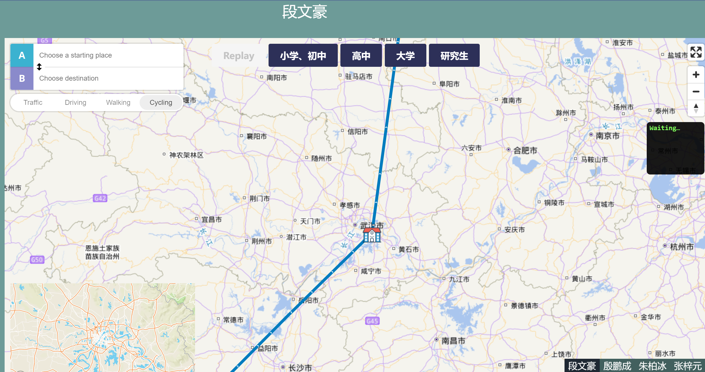
    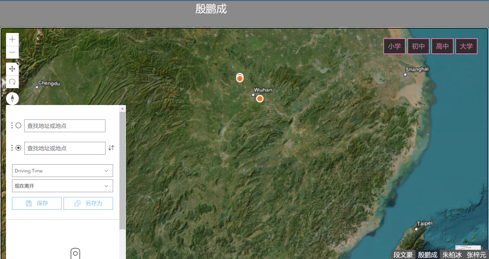
    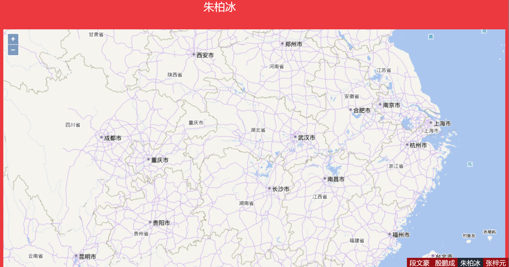
    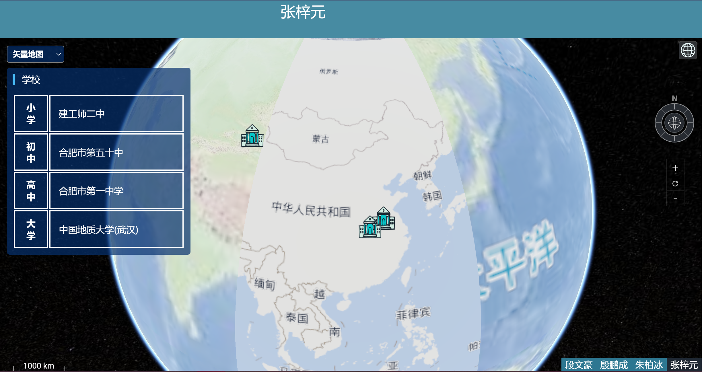
</center>


###  段文豪

####  底图加载

1. 加载天地图

在天地图申请`token`，然后通过`http://t7.tianditu.gov.cn/vec_w/wmts?SERVICE=WMTS&REQUEST=GetTile&VERSION=1.0.0&LAYER=vec&STYLE=default&TILEMATRIXSET=w&FORMAT=tiles&TILECOL={x}&TILEROW={y}&TILEMATRIX={z}&tk="你的token"`来获取地图服务。

```javascript
var vecSource = {
    "type": "raster",
    'tiles': [ "http://t7.tianditu.gov.cn/vec_w/wmts?SERVICE=WMTS&REQUEST=GetTile&VERSION=1.0.0&LAYER=vec&STYLE=default&TILEMATRIXSET=w&FORMAT=tiles&TILECOL={x}&TILEROW={y}&TILEMATRIX={z}&tk=f5347cab4b28410a6e8ba5143e3d5a35"
    ],
    'tileSize': 256
};
var cvaSource = {
    "type": "raster",
    'tiles': [
"http://t7.tianditu.gov.cn/cva_w/wmts?SERVICE=WMTS&REQUEST=GetTile&VERSION=1.0.0&LAYER=cva&STYLE=default&TILEMATRIXSET=w&FORMAT=tiles&TILECOL={x}&TILEROW={y}&TILEMATRIX={z}&tk=f5347cab4b28410a6e8ba5143e3d5a35"
    ],
    'tileSize': 256
};

// 矢量图层
var vecLayer = {
    "id": "vecsrc",
    "type": "raster",
    "source": "vecsrc",
    "minzoom": 0,
    "maxzoom": 20
};
var cvaLayer = {
    "id": "cvasrc",
    "type": "raster",
    "source": "cvasrc",
    "minzoom": 0,
    "maxzoom": 20
};


var map = new mapboxgl.Map({
    // 地图容器div的id
    container: 'mb-map', // container id
    style: {
        //设置版本号，一定要设置
        "version": 8,
        //添加来源
        "sources": {
            "vecsrc": vecSource,
            "cvasrc": cvaSource,
        },
        //设置加载并显示来源的图层信息
        "layers": [vecLayer, cvaLayer],
    },
    center: [114.339408, 30.61271],
    zoom:6,
});
```

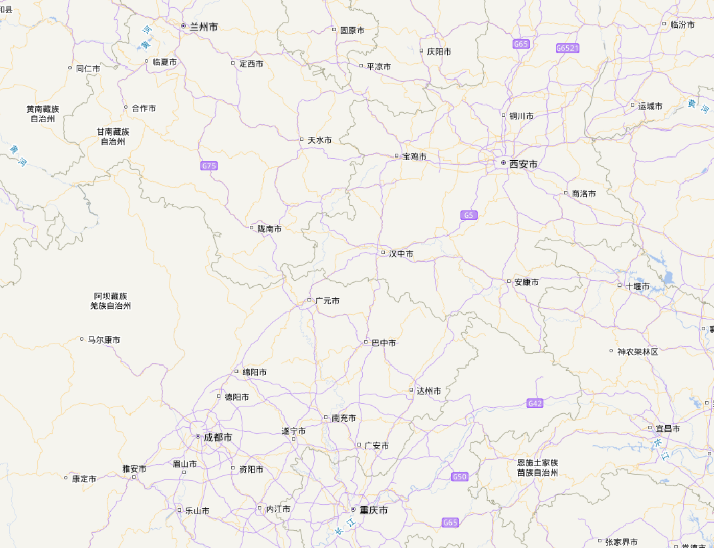

2. 加载`mapbox`的矢量图层(不建议)

`mapbox`自带许多样式图层，有`light`、`dark`、`img`

```javascript
style: "mapbox://styles/mapbox/streets-v10",
```

上述放入`map`初始化中。

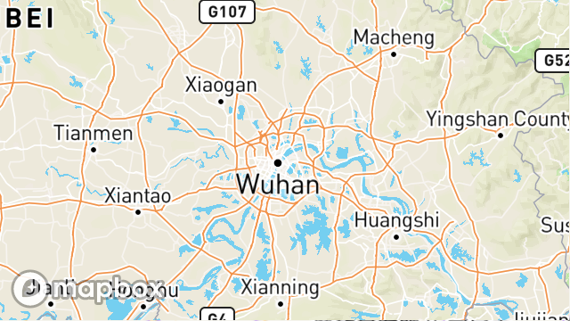

####  控件设计

1. 全屏控件

添加了一个可点击的地图控件，使用户能够切换全屏模式的开启和关闭。

```javascript
map.addControl(new mapboxgl.FullscreenControl());
```

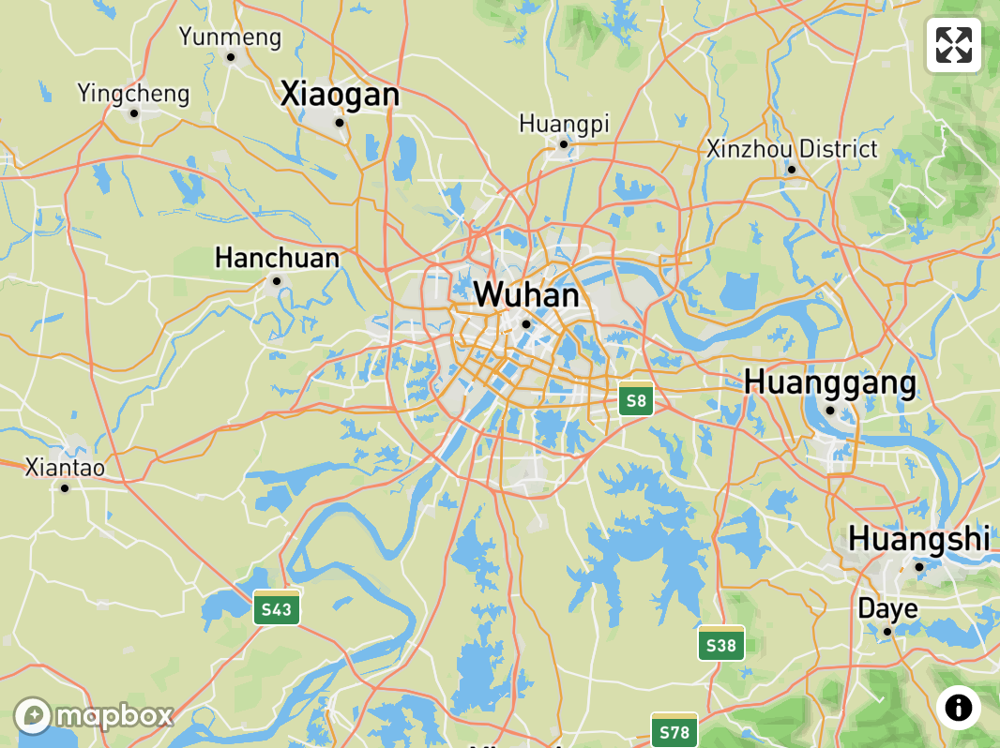

2. 显示缩放和旋转控件

用于缩放和旋转调整。

```javascript
map.addControl(new mapboxgl.NavigationControl());
```

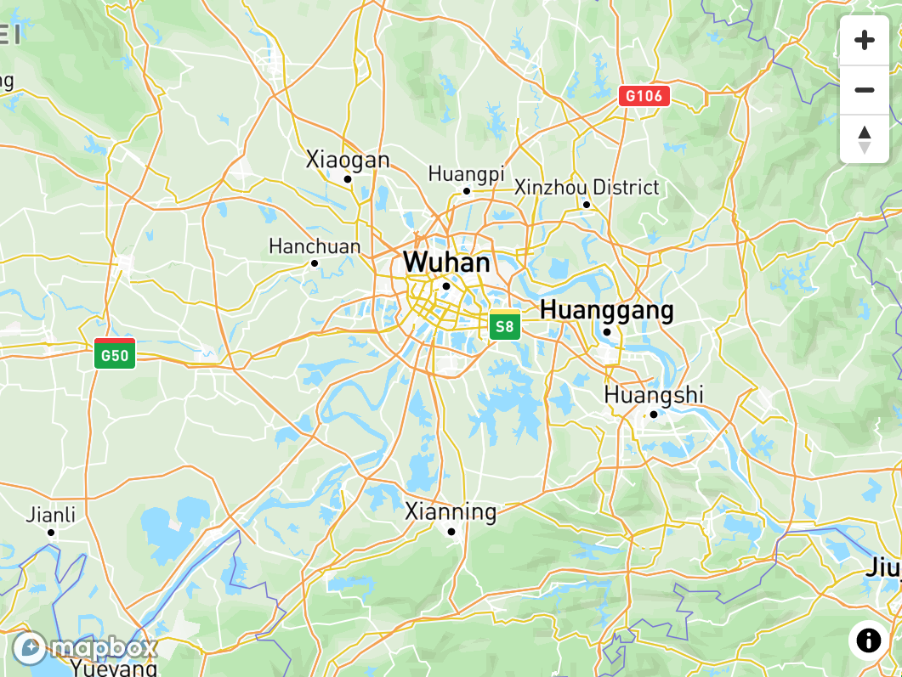

3. 帧率显示控件

```javascript
map.addControl(new mapboxgl.FrameRateControl());
```

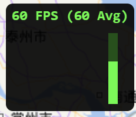

4. 导航控件

使用`mapbox-gl-directions`插件来显示来自`Mapbox Directions API`的结果。点击地图，添加出发地和目的地，并使用切换键在可用的路线配置中进行切换。

```javascript
var directions = new MapboxDirections({
    accessToken: 'pk.eyJ1Ijoienp6aWlpIiwiYSI6ImNsYmV1cWtqaTAwMWMzbnM3cGYzdG9xanEifQ.Y8VtfjgM1lBszfFHVoDsFw',
    unit: 'metric',
    profile: 'mapbox/cycling'
  });

map.addControl(directions, 'top-left');
```

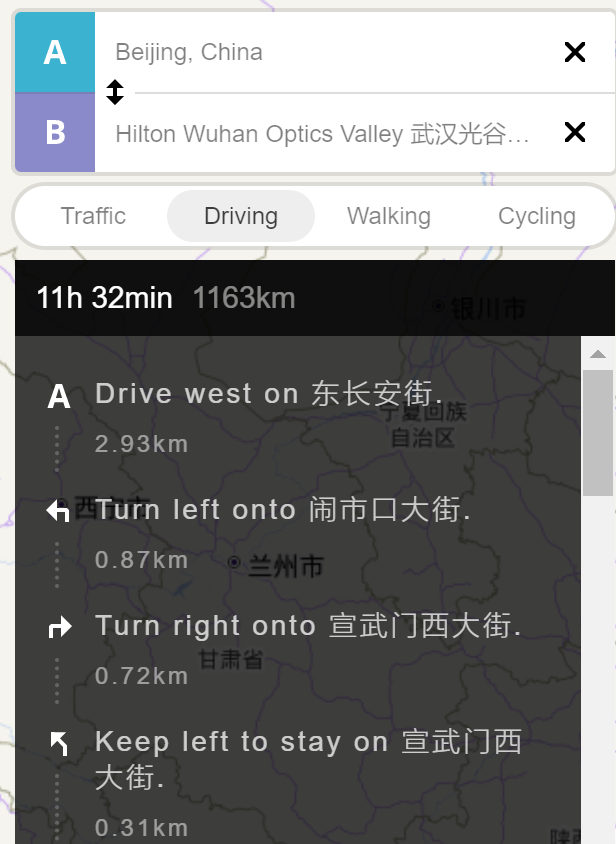

5. 鹰眼控件

`mapbox`没有提供有关的控件和插件，需要自己写一个。

```javascript
function Minimap ( options )
{
	Object.assign(this.options, options);

	this._ticking = false;
	this._lastMouseMoveEvent = null;
	this._parentMap = null;
	this._isDragging = false;
	this._isCursorOverFeature = false;
	this._previousPoint = [0, 0];
	this._currentPoint = [0, 0];
	this._trackingRectCoordinates = [[[], [], [], [], []]];
}

	options: {
		id: "mapboxgl-minimap",
		width: "320px",
		height: "180px",
		style: "mapbox://styles/mapbox/streets-v10",
		center: [114.339408, 30.61271],
		zoom: 6,

		// should be a function; will be bound to Minimap
		zoomAdjust: null,

		// if parent map zoom >= 18 and minimap zoom >= 14, set minimap zoom to 16
		zoomLevels: [
			[18, 14, 16],
			[16, 12, 14],
			[14, 10, 12],
			[12, 8, 10],
			[10, 6, 8]
		],

		lineColor: "#08F",
		lineWidth: 1,
		lineOpacity: 1,

		fillColor: "#F80",
		fillOpacity: 0.25,

		dragPan: false,
		scrollZoom: true,
		boxZoom: false,
		dragRotate: false,
		keyboard: false,
		doubleClickZoom: false,
		touchZoomRotate: false
	},
```

详细细节见`mapbox-mini.js`。

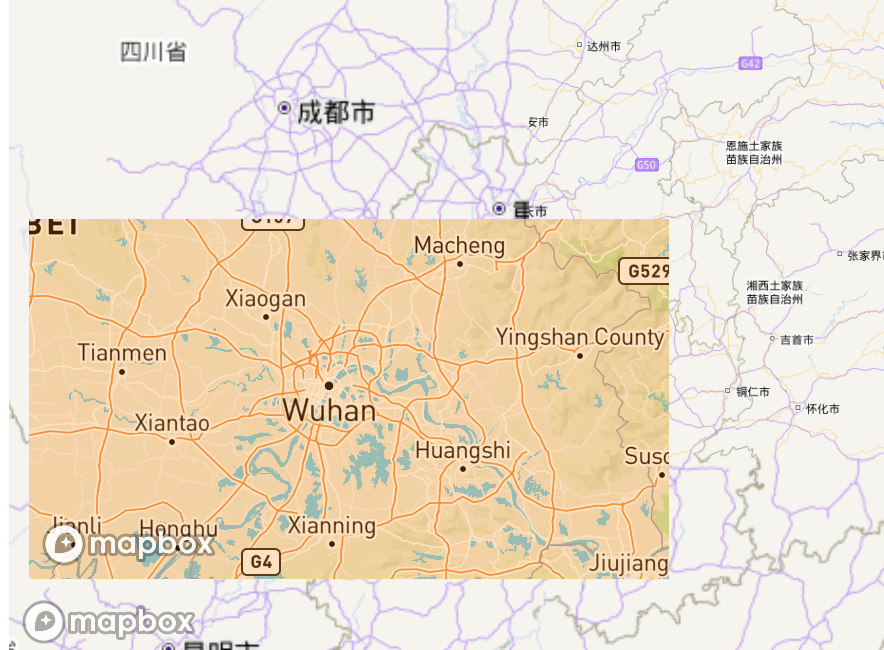

####  升学路线

1. 加入学校`source`，显示小学、初中、高中、大学、研究生的学校。

   该数据以`geojson`格式编辑，且`description`为`html`的富文本形式，可以在后续直接插入不需要进行解析。

```javascript
map.addSource('places', {
        'type': 'geojson',
        'data': {
            'type': 'FeatureCollection',
            'features': [
                {
                    'type': 'Feature',
                    'properties': {
                        'description':
                        '<h2>禾青中心学校</h2><p><strong>小学、初中</strong>。我在这个学校待了10年,从学前班到初三一直在这里接受教育。现已改名为禾青芙蓉学校</p>',
                        'icon': 'school'
                    },
                    'geometry': {
                        'type': 'Point',
                        'coordinates': juniorSchool
                    }
                },
                {
                    'type': 'Feature',
                    'properties': {
                        'description':
                            '<h2>冷水江市第一中学</h2><p><strong>高中学校</strong>。在99年出了文理科状元，因此在我们地级市出名，现阶段的一中教学质量出现了严重下滑。</p>',
                        'icon': 'school'
                    },
                    'geometry': {
                        'type': 'Point',
                        'coordinates': seniorSchool
                    }
                },
                {
                    'type': 'Feature',
                    'properties': {
                        'description':
                            '<h2>中国地质大学(武汉)</h2><p><strong>大学</strong>。2020年我来到中国地质大学求学，选择了测绘类专业，分流至地理空间信息工程。现阶段研究方向是遥感智能解疑算法。</p>',
                        'icon': 'school'
                    },
                    'geometry': {
                        'type': 'Point',
                        'coordinates': undergraduate
                    }
                },
                {
                    'type': 'Feature',
                    'properties': {
                        'description':
                            '<h2>中国科学院空天信息创新研究院</h2><p><strong>研究生与博士</strong>。希望今年可以顺利升学，然后就可以全心身投入到科研之中了！</p>',
                        'icon': 'school'
                    },
                    'geometry': {
                        'type': 'Point',
                        'coordinates': graduate
                    }
                },
            ]
        }
    });
```

2. 自定义`icon`，加入学校🏫图标和飞机✈的图标

```javascript
// 加载自定义icon
map.loadImage('./imgs/school.png',(error, image) => {
    if(error) throw error;
    map.addImage('school', image);
    console.log('school init')
})

// 加载自定义icon
map.loadImage('./imgs/airport.png',(error, image) => {
    if(error) throw error;
    map.addImage('myAirport', image);
    console.log('airport init')
    map.addLayer({
        'id': 'point',
        'source': 'point',
        'type': 'symbol',
        'layout': {
            // To add a new image to the style at runtime see
            // https://docs.mapbox.com/mapbox-gl-js/example/add-image/
            'icon-image': 'myAirport',
            'icon-size': 1.,
            'icon-rotate': ['get', 'bearing'],
            'icon-rotation-alignment': 'map',
            'icon-allow-overlap': true,
            'icon-ignore-placement': true
        }
    });
})
```

3. 将学校间连接起来，并加入飞机飞行动画模拟我的路线轨迹。

```javascript
// 箭头-右
var svgXML =
`<svg viewBox="0 0 1024 1024" xmlns="http://www.w3.org/2000/svg"> 
    <path d="M529.6128 512L239.9232 222.4128 384.7168 77.5168 819.2 512 384.7168 946.4832 239.9232 801.5872z" p-id="9085" fill="#ffffff"></path> 
</svg>
`
var svgBase64 = 'data:image/svg+xml;base64,' + window.btoa(unescape(encodeURIComponent(svgXML)));
const juniorSchool = [111.432383, 27.608648]
const seniorSchool = [111.440355, 27.691964]
const undergraduate = [114.617146, 30.457564]
const graduate = [116.281528, 40.072093]
// 路线
const route = {
    'type': 'FeatureCollection',
    'features': [
        {
        'type': 'Feature',
        'geometry': {
            'type': 'LineString',
            'coordinates': [juniorSchool, seniorSchool, undergraduate, graduate]
            }
        }
    ]
};
var realroute = {
    'type': 'FeatureCollection',
    'features':[{
        'type': 'Feature',
        'geometry': {
            'type': 'LineString',
            'coordinates': []
        }
    }]
}
// 沿路线运动的点.
// 以初始点初始化.
const point = {
    'type': 'FeatureCollection',
    'features': [
        {
        'type': 'Feature',
        'properties': {},
            'geometry': {
            'type': 'Point',
            'coordinates': juniorSchool
            }
        }
    ]
};
// 计算距离.
const lineDistance = turf.length(route.features[0]);
const arc = [];
//在弧线和动画中使用的步骤数，更多的步骤表示
//平滑的弧线和动画，但过多的步骤将导致
//低帧速率
const steps = 500;
// 在两个点的“起点”和“终点”之间画一条弧
for (let i = 0; i < lineDistance; i += lineDistance / steps) {
    const segment = turf.along(route.features[0], i);
    arc.push(segment.geometry.coordinates);
}
// 根据弧坐标更新route
route.features[0].geometry.coordinates = arc;
// 用于根据route增加点测量值.
let counter = 0;
map.on('load', () => {
    let arrowIcon = new Image(20, 20)
    arrowIcon.src = svgBase64
    arrowIcon.onload = function() {
        map.addImage('arrowIcon', arrowIcon)
        console.log('arrow')
    }
    map.addSource('route', {
        'type': 'geojson',
        'data': route
    });
    map.addSource('realroute',{
        'type': 'geojson',
        'data': realroute
    }) 
    map.addSource('point', {
        'type': 'geojson',
        'data': point
    });  
    map.addLayer({
        'id': 'route',
        'source': 'route',
        'type': 'line',
        'paint': {
            'line-width': 5,
            'line-opacity': 1,
            'line-color': '#007cbf'
        }   
    });
    map.addLayer({
        'id': 'realroute',
        'type': 'line',
        'source': 'realroute',
        'paint': {
            'line-width': 5,
            'line-opacity': 1,
            'line-color': '#FF9900',
        }
    });
    map.addLayer({
        'id': 'arrawLayer',
        'type': 'symbol',
        'source': 'route',
        'layout': {
            'symbol-placement':'line',
            'symbol-spacing': 50,
            'icon-image': 'arrowIcon',
            'icon-size': 0.25
        }
    })
```

一共三个图层，一个静态路线`route`、动态路线`realroute`、箭头图层`arrawLayer`。

4. `popup`弹出框

点击每个学校，弹出弹出框，展示基本信息。

```javascript
map.on('click', 'places', (e) => {
        const coordinates = e.features[0].geometry.coordinates.slice();
        const description = e.features[0].properties.description;
        while (Math.abs(e.lngLat.lng - coordinates[0]) > 180) {
            coordinates[0] += e.lngLat.lng > coordinates[0] ? 360 : -360;
        } 
        new mapboxgl.Popup()
            .setLngLat(coordinates)
            .setHTML(description)
            .addTo(map);
    });
    map.on('mouseenter', 'places', () => {
        map.getCanvas().style.cursor = 'pointer';
    });
    map.on('mouseleave', 'places', () => {
        map.getCanvas().style.cursor = '';
    });
```

5. `flyto()`

`maobox`自带一个切换视角的函数，`flyto()`。且在切换过程中，带有缩放、旋转。

```javascript
function flytoJunior(){
    const start = {
        center: [114.339408, 30.61271],
        zoom: 6,
        pitch: 0,
        bearing: 0
    };
    const end = {
        center: juniorSchool,
        zoom: 12.5,
        bearing: 130,
        pitch: 75
    };
    const target = isAtStart ? end : start;
    isAtStart = !isAtStart;
    map.flyTo({
        ...target,
        duration: 12000,
        essential: true
    });
}
```

同时设置四个按钮，用于切换跳转。

```html
<div class="overlay">
    <button id="replay">Replay</button>
    <button onclick="flytoJunior()">小学、初中</button>
    <button onclick="flytoSenior()">高中</button>
    <button onclick="flytoUndergraduate()">大学</button>
    <button onclick="flytoGraduate()">研究生</button>
</div>
```

这一`button`组有一流畅的动画效果，通过`css`实现的。

```css
.overlay button {
        font: 600 12px/20px 'Helvetica Neue', Arial, Helvetica, sans-serif;
        color: #fff;
        display: inline-block;
        margin: 0;
        padding: 10px 20px;
        border: none;
        cursor: pointer;
        border-radius: 3px;
        outline: none;
        z-index: 1;
        position: relative;
        font-size: inherit;
        font-family: inherit;
        background-color: hsl(236, 32%, 26%);
    }
    .overlay button::before {
        content: '';
        z-index: -1;
        position: absolute;
        top: 0;
        bottom: 0;
        left: 0;
        right: 0;
        background-color: #fc2f70;
        transform-origin: center right;
        transform: scaleX(0);
        transition: transform 0.25s ease-in-out;
        border-radius: 3px;

    }
    .overlay button:hover {
        cursor: pointer;
    }
    
    .overlay button:hover::before {
        transform-origin: center left;
        transform: scaleX(1);
    }
    .overlay button:disabled {
        background: #f5f5f5;
        color: #c3c3c3;
    }
```

上述为全部内容，整体效果如下。


<center class="half">
    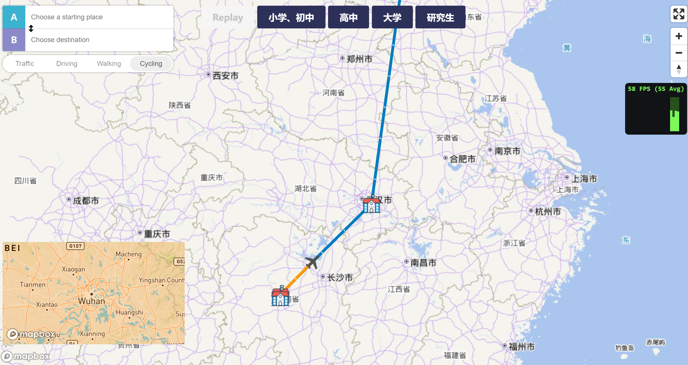
    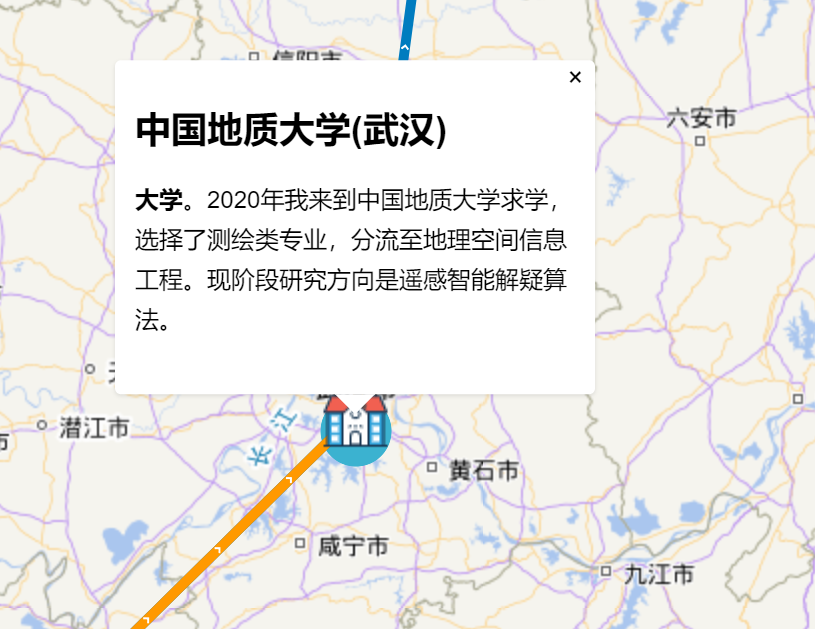
    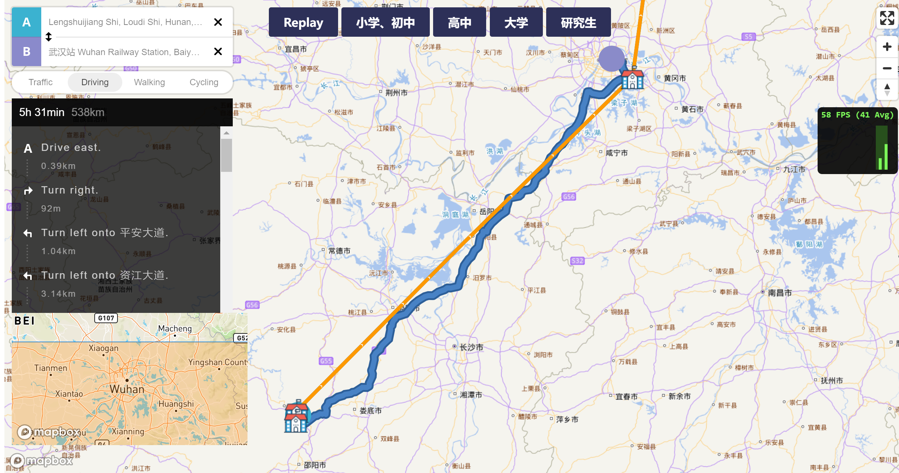
    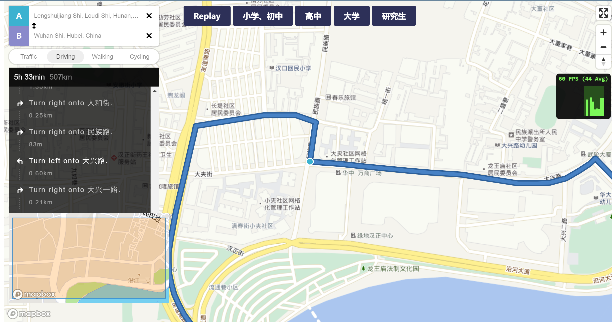
</center>


###  殷鹏成


###  张梓元

1. 构建基本场景，创建一个 `div `作为 `Cesium `容器，利用 `new Cesium.Viewer `函数创建 `Viewer `并设置 `Cesium `内置控件的显示与隐藏和缩放级别等容器属性。
2. 利用 `viewer.imageryLayers.addImageryProvider` 函数加载天地图矢量地图、影像底图 和地形图等，通过 `Cesium.WebMapTileServiceImageryProvider` 创建地图服务的 Rest 请求。 将加载的图层保存到数组中，创建图层控件，控制图层的显示和隐藏。

```javascript
let TDTLayer_cva = viewer.imageryLayers.addImageryProvider(new Cesium.
WebMapTileServiceImageryProvider({
//天地图 URL
url: "http://t0.tianditu.gov.cn/cva_w/wmts?tk=f581acc25f8c0a5453d4f5c4e87fc8ff",
//图层名称，vec：矢量底图、img：卫星影像底图、cva: 矢量注记图层（中文）、eva: 矢量注记图层（英文）、cia: 注记图层（中文）、eia: 注记图层（英文）、ter: 地形晕渲底图、cta: 注记（中文）、ibo: 全球国界
layer: "cva",
//瓦片样式
style: "default",
//比例尺
tileMatrixSetID: "w",
//请求格式
format: "tiles",
// 设置天地图瓦片级别（很关键）
maximumLevel: 18
}));
```

利用图层控件切换图层效果如下所示。

<center class="half">
    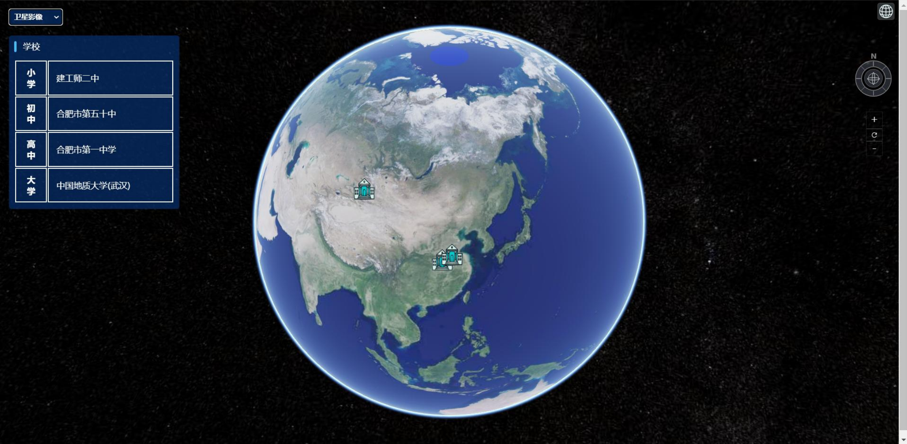
    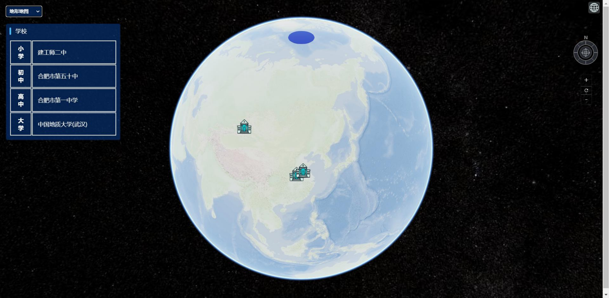
</center>

3. 添加常用地图控件。`Cesium `没有内置的比例尺、罗盘等，需要通过第三方库 `Cesium-navigation` 加载。下载该库，并用其提供的接口添加比例尺、罗盘等地图控件。
4. 获 得 学 校 的 坐 标 数 据 和 属 性 信 息 ， 并 以 `GeoJSON `的 形 式 保 存 。 利 用 `Cesium.GeoJsonDataSource.load `函 数 可 以 将 `Ajax `请 求 到 的 `GeoJSON `数 据 创 建 成 `GeoJsonDataSource`，并遍历实体，设置实体的样式。

```javascript
entities.forEach(entity => {
// 重置图片，图片大小，大小单位为米
entity.billboard.image = '../asset/image/学校.png'
entity.billboard.width = 40;
entity.billboard.height = 40;
entity.billboard.sizeInMeters = false;
}
```

学校的 `GeoJson `数据显示如下图，并创建一个表格，用于陈列学校信息。

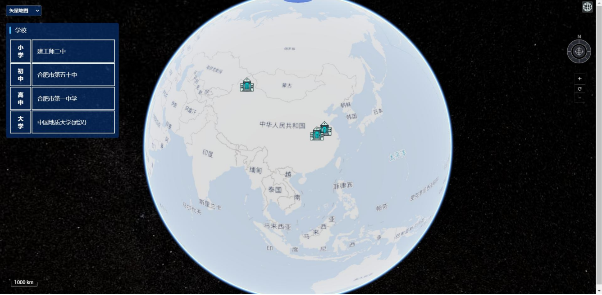

5.  设置跳转

`Cesium `的跳转动画可以通过设置相机（`Camera`）或视图（`Viewer`）的移动来设置飞行 效果。相机跳转是指直接操作场景中的相机对象，控制相机的位置、方向、缩放等属性，从 而改变场景的视角和显示效果，`Cesium `提供了多种相机操作和动画效果，如平移、旋转、 缩放、飞行等，可以通过 `Camera `对象和 `Camera` 操作方法来实现。

```javascript
viewer.camera.flyTo({
destination: Cesium.Cartesian3.fromDegrees(longitude, latitude, height),
duration: 3
});
```

`Viewer `跳转是指直接操作场景中的 `Viewer `对象，控制场景的状态和属性，从而改变整 个场景的显示效果。`Viewer `跳转可以改变场景的时间、位置、姿态、地形、图层、相机等 属性，可以通过 `Viewer `对象和 `Viewer `操作方法来实现。

```javascript
 viewer.camera.setView({
    destination: Cesium.Cartesian3.fromDegrees(longitude, latitude, height),
    orientation: {
        heading: Cesium.Math.toRadians(0),
        pitch: Cesium.Math.toRadians(-90),
        roll: Cesium.Math.toRadians(0)
        }
});
```

本案例通过 `viewer.camera.flyTo` 实现跳转效果。点击表格中的学校名称，即可触发视图 的飞行动画，将视图跳转至学校所在位置。

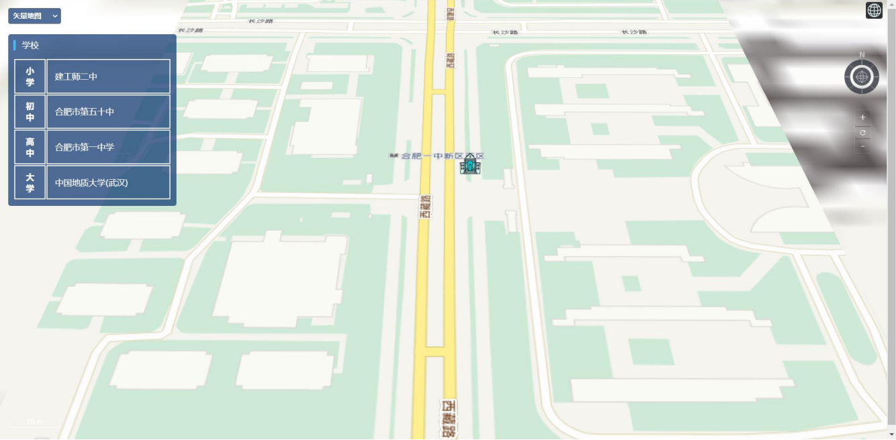

###  朱柏冰

由于在实习二中我已经实现了绘图控件，因此我在该基础上，继续加入了其他控件功能，包括比例尺控件、全屏查看控件和鼠标位置控件。实现方式如下：

将绘图功能封装到控件中，作为工具，更利于使用。首先确定实现该控件的所有需求：（1）具有一个工具条，包含指针、绘点、绘线、绘面、绘圆、绘矩形、清空绘制这7个按钮；
（2）单击各个绘图按钮将切换至对应的绘图状态；
（3）单击指针按钮切换为非绘图状态；
（4）单击清空绘制清理掉所有已绘制的图形。

代码实现：

（1）`ol.control.Control`类是`openlayers`中所有控件的基类，自定义绘图控件，以继承该类。

（2）定义按钮。

  定义`source_`对象用于后续获取图层，定义`drawing_`对象用于后续实现交互绘制。定义按钮中指针、绘点、绘线、绘面、绘圆、绘矩形、清空功能的名称分别为`'None'`, `'Point'`, `'LineString'`, `'Polygon'`, `'Circle'`, `'Box'`, `'Clear'`利用`document.createElement('div')`生成一个div标签，设置各按钮的元素的`class`属性名称。

```javascript
this.source_ = undefined;
this.drawing_ = undefined;
this.drawType = ['None', 'Point', 'LineString', 'Polygon', 'Circle', 'Box', 'Clear'];
var defaultControlClassName = 'ol-unselectable ol-control';
this.element = document.createElement('div');
this.element.className = defaultControlClassName + ' ' + 'drawtools';
```

通过`document.createElement('button')`创建按钮，设置按钮的属性。

```javascript
var createchildElement = function(options){
    var btn = document.createElement('button');
    btn.className = options.class;
    btn.id = options.id;
    var tipLable = 'Draw ' + options.value;
    btn.title = tipLable;
    btn.type = options.type;
    btn.value = options.value;
    return btn;
};
```

为按钮与名称建立一一对应关系，设置按钮的样式。

```javascript
this.drawType.forEach(element => {
    var btn = createchildElement({
        type: 'button',
        class: 'drawBtn',
        value: element,
        id: 'ol-draw-' + element.toLocaleLowerCase()
    })
    btn.onclick = function(evt){
        evt.preventDefault();
        this.btnFouceChanged(evt);
        var value = evt.target.getAttribute('value');
        this.addInteraction(value);
    }.bind(this);
    this.element.appendChild(btn);
});

ol.control.Control.call(this, {
    element: this.element,
    target: opt_options.target
})
```

通过`addInteraction`实现交互的绘图命令切换功能。

```javascript
ol.control.DrawControl.prototype.addInteraction = function(shapeType){
    this.initSource();
    if(shapeType !== 'None'){
        var geomFunc = undefined;
        if(shapeType === 'Clear'){
            this.source_.clear();
            return;
        }
        if(shapeType === 'Box') {
            shapeType = 'Circle';
            geomFunc = ol.interaction.Draw.createBox();
        }
        this.drawing_ = new ol.interaction.Draw({
            source: this.source_,
            type: shapeType,
            freehand: false,    //按住shift可以跟踪鼠标绘制
            geometryFunction: geomFunc
        });
        this.getMap().addInteraction(this.drawing_);
    }
}
```

（3）按钮样式

​	新建一个`css`文件来设定按钮的样式。
​	首先规定工具条的位置以及格式，令按钮纵向排列。

```css
.drawtools{
    top: 5em;
    right: 1em;
    flex-direction:column;
}
```

然后为每个按钮插入图片作为标识。

```css
#ol-draw-none{
    background: url(./img/pointer_16px.png) no-repeat;
}
#ol-draw-point{
    background: url(./img/point_16px.png) no-repeat;
}
#ol-draw-linestring{
    background: url(./img/linestring_16px.png) no-repeat;
}
#ol-draw-polygon{
    background: url(./img/polygon_16px.png) no-repeat;
}
#ol-draw-circle{
    background: url(./img/circle_16px.png) no-repeat;
}
#ol-draw-box{
    background: url(./img/box_16px.png) no-repeat;
}
#ol-draw-clear{
    background: url(./img/clear.png) no-repeat;
}
```

在加载瓦片地图时，在默认控件的基础上，再加上其他内置的控件，即`MousePosition()`（鼠标位置控件）、`FullScreen()`（全屏查看控件）和`ScaleLine()`（比例尺控件）。

```javascript
    var map = new ol.Map({
        target: 'map',
        controls: ol.control.defaults().extend([
            new ol.control.MousePosition(),
            new ol.control.FullScreen(),
            new ol.control.ScaleLine()
        ]),
```

最后在`html`的`body`中添加引用两个`js`文件，实现4种地图控件，效果如下。

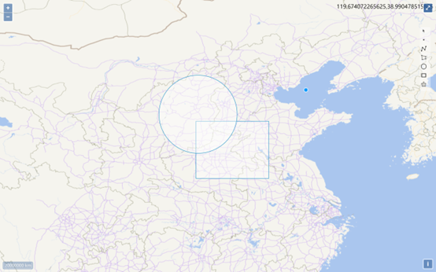

动画效果的主要实现步骤如下：

（1）新建一个`html`页面，加载天地图瓦片图层；

（2）在地图容器div层中分别新建四个按钮，并设置按钮的`ID`值；

（3）为这些按钮添加相应的单机函数，分别实现各种动画效果的定位功能。在函数中先实例化动画功能类，然后通过`ol.View`类的`animate`方法设置动画效果。我分别通过旋转、弹性、反弹、自旋定位到了小学、初中、高中、大学。实现界面如下：

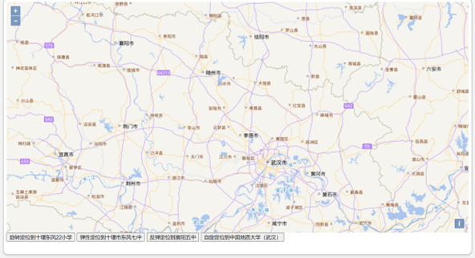

在实习一中制作的个人介绍页面中，通过`<a>`添加页面的点击跳转，查看教育经历。

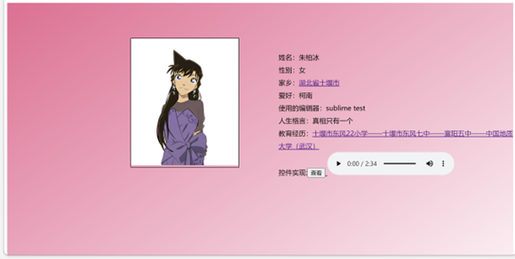

##  总结

