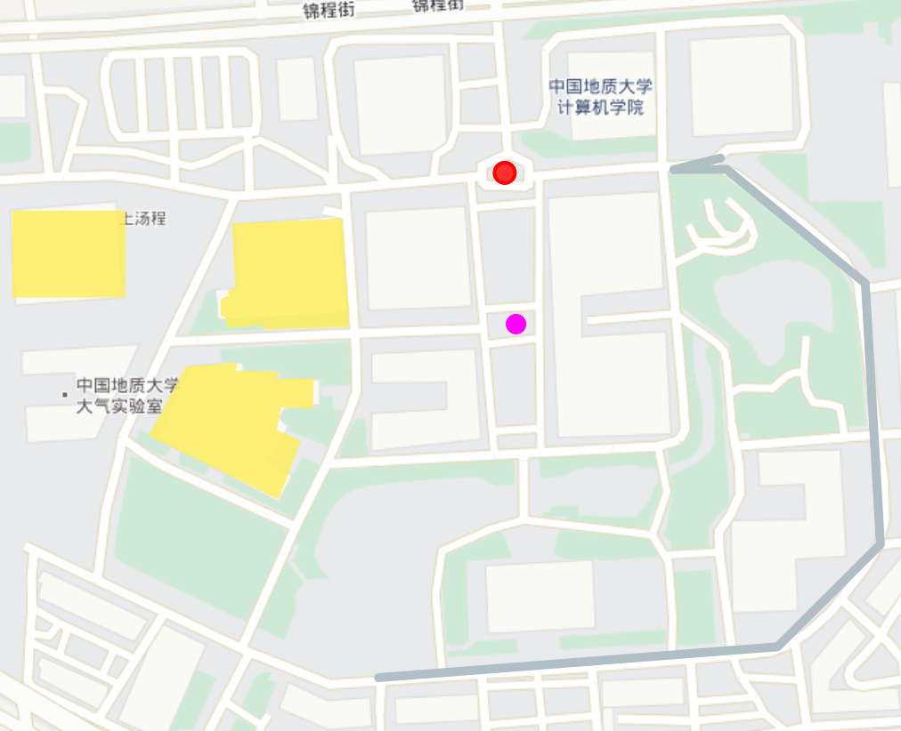
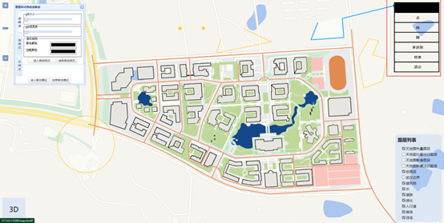

[toc]

<div style=”page-break-after: always;”></div>

##  实习任务

1、 选择一种公共地图资源，加载地图服务作为背景图。

2、 自己制作地大校园部分建筑的GeoJSON文件，如三食堂位置、教一楼边界线和足球场区域。

3、 分别使用不同颜色的Point，LineString和Polygon显示自己的GeoJSON文件。

4、 参照教材中的代码示例，编写一个地图显示页面，添加三个功能按钮，点击按钮后使用鼠标点击地图，在地图上分别添加地大的其它建筑，至少包含点、线、区图形。

5、 修改显示的样式。

6、 修改显示的位置。

7、 试着通过GeoServer发布一个地图，在自己的前端实现调用。（可选）

##  GeoServer

GeoServer是一个免费开源的地理数据服务器，可以发布空间数据服务（例如Web Map Service、Web Feature Service和Web Coverage Service），以使客户端应用程序可以通过网络访问和使用这些数据。它支持多种数据格式和空间数据库，并提供了强大的样式和渲染选项来创建漂亮的地图。GeoServer还支持安全机制，可以控制用户和组的访问权限。

GeoServer的主要功能和作用包括：

1.数据发布：GeoServer可以发布多种空间数据服务，如WMS、WFS、WCS等。

数据存储：GeoServer可以连接多种数据源，如PostGIS、Oracle Spatial、ArcSDE等，以及GeoTIFF、Shapefile等文件格式。。

2.样式管理：GeoServer可以通过内置的样式编辑器或使用CSS、SLD等来创建、编辑和管理样式。

3.安全管理：GeoServer提供基于角色的安全机制，可以控制用户和组的访问权限。

4.插件支持：GeoServer支持多种插件，如REST API、GeoWebCache、WPS等，可以扩展其功能。

5.易于部署和使用：GeoServer可以轻松部署到任何Java应用服务器中，并提供易于使用的Web界面进行配置和管理。

GeoServer是一个功能强大、易于使用、高度可定制的地理数据服务器，可以帮助用户快速发布和管理空间数据服务。

##  TASK 4

###  总体设计

<center class="half">
    
    
    
    
</center>
<center style="font-size:15px;color:#000000;">图1 手风琴样式设计</center> 


###  段文豪

####  3维模型加载

数据提供者为20级遥感专业姜传宝同学。

加载三维模型，需要用到`three.js`。

```javascript
const loader = new THREE.GLTFLoader();
loader.load(
    '../DWH/data/未来城.gltf',
    (gltf) => {
        this.scene.add(gltf.scene);
    }
);
```

然后通过`mapbox`进行摄像头和光线的设置。

```javascript
const modelOrigin = [114.612881,30.458611];
const modelAltitude = 0;
const modelRotate = [Math.PI / 2, 0, 0];
    
const modelAsMercatorCoordinate = mapboxgl.MercatorCoordinate.fromLngLat(
    modelOrigin,
    modelAltitude
);
const modelTransform = {
translateX: modelAsMercatorCoordinate.x,
translateY: modelAsMercatorCoordinate.y,
translateZ: modelAsMercatorCoordinate.z,
rotateX: modelRotate[0],
rotateY: modelRotate[1],
rotateZ: modelRotate[2],
scale: modelAsMercatorCoordinate.meterInMercatorCoordinateUnits()
};
     
const THREE = window.THREE;
     
const customLayer = {
    id: '3d-model',
    type: 'custom',
    renderingMode: '3d',
    onAdd: function (map, gl) {
        this.camera = new THREE.Camera();
        this.scene = new THREE.Scene();
        
        const directionalLight = new THREE.DirectionalLight(0xffffff);
        directionalLight.position.set(0, 1000, 1000).normalize();
        this.scene.add(directionalLight);
        
        const directionalLight2 = new THREE.DirectionalLight(0xffffff);
        directionalLight2.position.set(0, 1000, -1000).normalize();
        this.scene.add(directionalLight2);
        
        const loader = new THREE.GLTFLoader();
        loader.load(
        '../DWH/data/未来城.gltf',
        (gltf) => {
            this.scene.add(gltf.scene);
            }
        );
        this.map = map;
        
        // use the Mapbox GL JS map canvas for three.js
        this.renderer = new THREE.WebGLRenderer({
            canvas: map.getCanvas(),
            context: gl,
            antialias: true
        });
        
        this.renderer.autoClear = false;
    },
    render: function (gl, matrix) {
        const rotationX = new THREE.Matrix4().makeRotationAxis(
        new THREE.Vector3(0.65, 0, 0),
        modelTransform.rotateX
    );
    const rotationY = new THREE.Matrix4().makeRotationAxis(
        new THREE.Vector3(0, 0.65, 0),
        modelTransform.rotateY
    );
    const rotationZ = new THREE.Matrix4().makeRotationAxis(
        new THREE.Vector3(0, 0, 0.65),
        modelTransform.rotateZ
    );
     
    const m = new THREE.Matrix4().fromArray(matrix);
    const l = new THREE.Matrix4()
    .makeTranslation(
        modelTransform.translateX,
        modelTransform.translateY,
        modelTransform.translateZ
    )
    .scale(
        new THREE.Vector3(
            modelTransform.scale,
            -modelTransform.scale,
            modelTransform.scale
        )
    )
    .multiply(rotationX)
    .multiply(rotationY)
    .multiply(rotationZ);
     
    this.camera.projectionMatrix = m.multiply(l);
    this.renderer.resetState();
    this.renderer.render(this.scene, this.camera);
    this.map.triggerRepaint();
    }
};
```

<center class="half">
    
    
    
</center>
<center style="font-size:15px;color:#000000;">图2 三维模型展示</center> 


####  加载GeoJSON格式

首先可以通过`QGIS`将`shp`文件转换为`GeoJSON`格式，这里我只选出了体育馆、地信楼、计院楼、公教一、公教二。并给他们一些属性描述，用于`popup`弹出框。

```javascript
// 请求geojson
let  buildings = null;
let allData = {}
$.ajax({
    url: './data/buildings.geojson',
    method: 'GET',
    dataType: 'json',
    success:(response)=>{
        buildings = response
        // console.log("part buildings", buildings)
        allData['buildings'] = buildings
        // console.log("part1 buildings", allData['buildings'] )

    },
    error:(error)=>{
        console.log(error);
    }
});

 var buildingLayer = {
        'id': 'buildings',
        'type': 'fill',
        'source': 'buildings', // reference the data source
        'layout': {},
        'paint': {
            'fill-color': ["case",
                ["boolean", ["feature-state", "hover"], false],
                '#0080ff',
                ['get', 'color']
            ],
            'fill-opacity': ['get', 'opacity'],
            'fill-outline-color':['get', 'outlineColor']
    }
}

map.on('load',()=>{
    map.addSource('buildings',{
        'type': 'geojson',
        'data': buildings,
        generateId: true
    });
    // Add a new layer to visualize the polygon.
    map.addLayer(buildingLayer);
    changeMapCursor();
})
```

在点击要素之后，会出现`popup`弹出框和颜色高亮。

```javascript
const contents = [];
    for (let i in layerProperties) {
        const properties = layerProperties[i];
        for (let p in properties) {
            if(p=='name'){
                const content = `<h2>${properties[p]}</h2>`
                contents.push(content);
            }else if( p == 'description'){
                const content = `<p><span>${properties[p]}</span></p>`
                contents.push(content);
            }
        }
    }

    const propertiesContent = `${contents.join('')}`;

    // 属性展示
    if (Object.keys(layerProperties).length > 0) {
        var popup = new mapboxgl.Popup()
            .setLngLat(e.lngLat)
            .setHTML(propertiesContent)
            .addTo(map);
        popup.on('close', function(e){
            let renderFeatures = map.queryRenderedFeatures(bbox, { layers: existLayersIds });
            renderFeatures.forEach(renderFeature => {
                // console.log('renderFeature', renderFeature);
                
                const { id, layer, source, properties } = renderFeature;
                // 属性数据存储
                layerProperties[layer.id] = properties;

                for (let i in layerHighlights) {
                    // 取消上次高亮
                    if (i === layer.id) {
                        const { id, source } = layerHighlights[i];
                        map.setFeatureState(
                            { source, id },
                            { hover: false }
                        );
                    }
                }
            });
        })
    }
```

颜色高亮的设置实在paint中，根据属性来进行过滤。

```javascript
'fill-color': ["case",
               ["boolean", ["feature-state", "hover"], false],
               '#0080ff',
               ['get', 'color']
              ]

const { id, layer, source, properties } = renderFeature;
        // console.log('feature', id)
        // 属性数据存储
        layerProperties[layer.id] = properties;
        // 添加新的高亮
        map.setFeatureState(
            { source, id },
            { hover: true }
        );
```

<center class="half">
    
    
    
</center>
<center style="font-size:15px;color:#000000;">图3 geojson格式展示</center> 


####  自定义GeoJSON格式

通过`geojson`包含点线面，并赋予不同的属性。其调用方式与上述相同，但注意不同类型的要素之间的样式调整。

<center class="half">
    
    
    
    
</center>
<center style="font-size:15px;color:#000000;">图4 自定义geojson格式展示</center> 


####  加载GeoServe服务


<center style="font-size:15px;color:#000000;">图5 geoserver图层发布</center> 

将湖北省的边界数据进行一个分布，然后调用wfs服务。

```javascript
var serverData = null;
$.ajax({
    url:'http://localhost:8088/geoserver/HuBei/ows?service=WFS&version=1.0.0&request=GetFeature&typeName=HuBei%3AHuBeiProvince&maxFeatures=50&outputFormat=application%2Fjson',
    method: 'GET',
    dataType: 'json',
    success:(response)=>{
        serverData = response
        // console.log("part buildings", custom)
        allData['wms-geojson'] = serverData
    },
    error:(error)=>{
        console.log(error);
    }
})

var geoserverL = {
    'id': 'wms-layer',
    'type': 'fill',
    'source': 'wms-source',
    'paint': {
        'fill-opacity': 0.5,
        'fill-color': "#ff8133",
        'fill-outline-color': "#ff1100",
        // 'fill-outline-opacity': 1,

    }
}
map.on('load',()=>{
    map.addSource('wms-source', {
        'type': 'geojson',
        'data': serverData,
        generateId: true
        
      });
    
    map.addLayer(geoserverL);
    
})
```

<center class="half">
    
    
    
</center>
<center style="font-size:15px;color:#000000;">图6 geoserver图层调用</center> 


#### 图层控制

```javascript
<div class="control-group">
    <h1>图层控制</h1>
<label class="control control--checkbox">天地图矢量图层
<input type="checkbox" checked="checked" id="vecLayer"/>
    <div class="control__indicator"></div>
</label>
<label class="control control--checkbox">3维图书馆模型
    <input type="checkbox" checked="checked" id="3DLayer" />
        <div class="control__indicator"></div>
</label>
<label class="control control--checkbox">geojson图层
<input type="checkbox" checked="checked" id="geojsonLayer"/>
    <div class="control__indicator"></div>
</label>
<label class="control control--checkbox">自定义geojson格式图层
<input type="checkbox" checked="checked" id="customLayer"/>
    <div class="control__indicator"></div>
</label>
<label class="control control--checkbox">geoserver图层
<input type="checkbox" checked="checked" id="geoserverLayer"/>
    <div class="control__indicator"></div>
</label>
</div>
```


<center style="font-size:15px;color:#000000;">图7 图层控制</center> 

####  样式更改

1. 表盘设计

<center class="half">
    
    
    
</center>
<center style="font-size:15px;color:#000000;">图8 样式面板</center> 


点包括：

+ 大小`radius`；
+ 透明度`opacity`；
+ 填充颜色`fill-color`；
+ 边框宽度`circle-stroke-width`；
+ 边框透明度`circle-stroke-opacity`；
+ 边框颜色`circle-stroke-color`；

线包括：

+ 线的宽度`line-width`；
+ 透明度`opacity`；
+ 颜色`color`；

面包括：

+ 透明度`opacity`；
+ 填充颜色`fill-color`；
+ 边框颜色`outline-color`；

2. 点击要素之后，更新样式面板，随后即可修改样式进行功能更新

<center class="half">
    
    
</center>
<center style="font-size:15px;color:#000000;">图9 样式修改</center> 


对于修改样式，在mapbox中不能指定给某个样式更改样式的api，但可以通过属性值的变化实时渲染，然后需要给每个要素添加对应的属性。

```json
{
    "type": "Feature",
    "properties": {
        "name":"艰苦朴素，求真务实",
        "description":"这是地大校训",
        "color": "#ff0000",
        "radius": 5,
        "opacity": 0.8,
        "strokeWidth": 2,
        "strokeColor": "#ff0000",
        "strokeOpacity": 1
    },
    "geometry": {
        "coordinates": [
            114.61290607494487,
            30.46173843002238
        ],
        "type": "Point"
    }
},
```

然后在自定义图层的时候将过滤条件添加进去。

```javascript
var custom_point = {
    id: 'custom-points',
    type: 'circle',
    source: 'custom-geojson',
    paint:{
        'circle-radius':['get', 'radius'],
        'circle-color': ["case",
            ["boolean", ["feature-state", "hover"], false],
            '#0080ff',
            ['get', 'color']
        ],
        'circle-opacity': ['get', 'opacity'],
        'circle-stroke-width': ['get', 'strokeWidth'],
        'circle-stroke-color': ['get', 'strokeColor'],
        'circle-stroke-opacity':['get', 'strokeOpacity']
    },
    filter: ['in', '$type', 'Point']
}
```

这里是点样式的设置方式，线和面类推。

####  绘制图层的修改

先前的实习已经实现了mapbox的绘制，这里可以对绘制的样式进行修改。

绘制方法是：先设置好样式，然后绘制对应要素即可。修改方法：设置好样式后，点击要素即可进行更改。

<center>
    
    
</center>
<center style="font-size:15px;color:#000000;">图10 绘制图层样式修改</center> 

### 殷鹏成

#### 数据准备

GeoServer发布地图的流程可以简单概括为以下几个步骤：

1. 准备数据：首先需要准备需要发布的地图数据，可以是各种矢量数据（如`Shapefile`、`PostGIS`、`Oracle`等），也可以是栅格数据（如`GeoTIFF`、`ArcGrid`等）。准备地大未来城的`shp`与`geojson`数据，武汉市边界的`shp`数据。

<center>
    
    
</center>

<center style="font-size:15px;color:#000000;">图11 数据准备</center> 

2.创建工作区（`Workspace`）：在`GeoServer`中创建一个工作区，一个工作区对应一个数据库或者一组数据集，通常情况下，一个工作区对应一个地理信息系统。


<center style="font-size:15px;color:#000000;">图12 工作空间</center> 

3.创建数据存储（`Data Store`）：在工作区中创建数据存储，用于管理发布的数据。数据存储可以是一个本地文件夹、数据库或远程`WMS`服务。


<center style="font-size:15px;color:#000000;">图13 创建数据源</center> 

4.发布图层（`Layer`）：在`GeoServer`中发布图层，即将准备好的数据发布为`WMS`或`WFS`服务，使其可以通过`Web`进行访问。


<center style="font-size:15px;color:#000000;">图14 编辑图层</center> 

5.配置样式（Style）：为发布的图层配置样式，包括颜色、线宽、填充等。

配置发布参数：在GeoServer中对发布的图层进行一些设置，如投影、坐标系、分辨率等。

6.部署服务：最后将发布好的地图服务部署到Web服务器中，供用户通过Web访问。


<center style="font-size:15px;color:#000000;">图15 预览图层</center> 

####  ArcGIS Maps SDK for JavaScript实现过程

（1）`ArcGIS Pro`与`ArcGIS Oline`发布`3D`白模数据

将地大未来城的`shp`文件添加高程字段，赋予其高程。在`ArcGIS Pro`中进行拉伸，显示出建筑物的高程值，其他的无高度的`geojson`正常显示，最后发布图层到`ArcGIS Oline`中，在`html`中运用。


<center style="font-size:15px;color:#000000;">图16 白膜查看</center> 

（2）交互绘制点、线、面

运用`"esri/widgets/Sketch/SketchViewModel"`类，添加草图绘制控件，实现绘制点线面的功能，同时可以修改显示的颜色。


<center style="font-size:15px;color:#000000;">图17 绘制点线面</center> 

（3）修改要素位置

点击绘画的要素，实现前后左右上下、旋转、移动或者实现单体编辑。


<center style="font-size:15px;color:#000000;">图18 修改要素</center> 

####  Openlayers实现过程

（1）图层控制，加载`GeoJson`格式的数据；

控制图层显示，使用`openlayers`加载地大`GeoJson`格式数据，即将`source`设为文件的`URL`。

```js
var buildLayer = new ol.layer.Vector({
    source: new ol.source.Vector({
        // 加载 GeoJSON 数据
        url: "/geojson/build.geojson",
        format: new ol.format.GeoJSON()
    }),
    style:new ol.style.Style({
        fill: new ol.style.Fill({
            color:[231, 229, 223, 1],

        }),
        stroke: new ol.style.Stroke({
            color: [0, 0,0,1],
            width: 2
        })
    }),
    name: "建筑物",
})
map.addLayer(buildLayer)  
```

右下角图层控制，可以对每个数据进行单独显示，控制，包含服务图层、绘画层和`GeoJson`数据层和影像层。


<center style="font-size:15px;color:#000000;">图19 总览</center> 

（2）利用`geoserver`发布数据，并加载在地图上；将`geoserver`发布数据武汉边界加入地图，获取其`URL`；


<center style="font-size:15px;color:#000000;">图20 geoserver图层查看</center> 

（3）交互绘制点、线、面；点击右上角绘画，可以绘制点、线、面、圆等图像。点击清空，会删除绘画层中所以`feature`。点击结束后，结束绘制。

<center style="font-size:15px;color:#000000;">图21 交互绘制</center> 

（4）点击要素修改要素样式；用`easyUI`进行样式属性修改，运用`jQuery`获得对应`id`下`input`中的`value`值，将属性传递给ol.style，最后通过setstyle函数将feature的样式修改。

```js
function createStyleFunction() {
    var linestyle=new ol.style.Style({
        stroke: new ol.style.Stroke({
        color: document.getElementById('lines-stroke-color').value,
        width: document.getElementById('lines-stroke-width').value
        })
    })
return linestyle}

function work() {
        console.log("2")
        styleall=createlineStyleFunction()
 }
```

其中，最重要的如何获得点击的要素信息。解决办法是用到`ol.interaction.Select`和`ol.interaction.Modify`两个类函数，可以实现点击要素，获得要素的属性信息。这样加上setstyle就可以快速实现点击要素修改属性。代码如下：

```js
function modifystyle(){
    selectInteraction = new ol.interaction.Select({
        condition: ol.events.condition.click,
    });

    // 创建 modify 交互对象
    modifyInteraction = new ol.interaction.Modify({
        features: selectInteraction.getFeatures(),
    });

    // 将 select 和 modify 交互对象添加到地图上
    map.addInteraction(selectInteraction);
    map.addInteraction(modifyInteraction);

    // 监听选中要素事件
    selectInteraction.on('select', function (event) {
        // 获取选中的要素
        var feature = event.selected[0];
        // console.log(styleall)

        // 将要素的样式设置为指定颜色
        feature.setStyle(styleall);
    });
}
```

具体演示如下：

点击对应样式，点击进入修改模式，滑动按钮修改大小、粗细，点击颜色进行取色。然后点击要素，实现样式修改。该功能对于发布的图层、加载图层，绘制图层中的单个要素都能运用，而不是对整个图层修改。

<center class="half">
    
    
    
</center>

<center style="font-size:15px;color:#000000;">图22 样式面板</center> 

具体效果：


<center style="font-size:15px;color:#000000;">图23 修改结果</center> 

（5）修改要素位置。

与修改样式选取单个要素相同，用到`ol.interaction.Select`和`ol.interaction.Modify`两个类函数，可以实现点击要素，获得要素的属性信息。对于移动，还需要用到`ol.interaction.Translate`类函数。代码如下：

```js
 // 传入选中的图形
modify = new ol.interaction.Translate({
    features: new ol.Collection(featureParam),
});
} else {
    // 先选择在修改.每次只编辑一个图形
    drawInteraction = new ol.interaction.Select({
        layers: [layer],
        feature: source.getFeatures(),
    });
    // 传入选中的图形
    // 这样做之后，需要点击选中要素才可以进行编辑
    modify = new ol.interaction.Translate({
        features: drawInteraction.getFeatures(),
    });
}

modify.on('translatestart', function (e) {
    try {
        console.log(e.target);
    } catch (e) {
        console.log(e);
    }
});
// 平移结束事件
modify.on('translateend', function (e) {
    try {
        console.log(e.target);
        featureParam[0].setStyle(style);
    } catch (e) {
    }
});

// 吸附鼠标
snap = new ol.interaction.Snap({
    pixelTolerance: 20,
    source: vectorSource
});
```

最终实现点击单个要素，实现单个要素演示：


<center style="font-size:15px;color:#000000;">图24 结果展示</center> 

###  张梓元

1、创建 `Cesium `场景，加载天地图并加载地图控件。地图场景包含的按钮和功能如下图所示:


<center style="font-size:15px;color:#000000;">图25 三维展示</center> 

2、 利用 `GeoServer `发布中国地质大学（武汉）未来城校区的 `ShapeFile `文件，创建工作 空间、存储仓库和图层。图层参考系为 `ESPG:4326`，坐标为经纬度。发布结果如下：


<center style="font-size:15px;color:#000000;">图26 图层发布</center> 

3、利用 `Ajax `请求 `Geoserver `的服务，请求到 `GeoJson `后，将数据载入并显示。载入时需要遍历对象为其设置样式。


<center style="font-size:15px;color:#000000;">图26 图层调用</center> 

4、选择某个要素，获取要素属性，并提供可视化的修改。例如，下图单击选择按钮， 切换选择对象模式通过色盘修改操场的颜色。

<center class="half">
    
    
</center>
<center style="font-size:15px;color:#000000;">图27 修改操场颜色</center> 


5、利用 `Cesium.ScreenSpaceEventHandler(viewer.scene.canvas)`创建鼠标事件对象，绑定 鼠标事件实现鼠标绘制点、线、面。


<center style="font-size:15px;color:#000000;">图28 绘制点线面</center> 

切换到“颜色选择”模式，同样可以点击要素并修改样式。


<center style="font-size:15px;color:#000000;">图29 修改绘制的点线面样式</center> 

6、鼠标点击获取相应的实体，并可以拖拽移动。


<center style="font-size:15px;color:#000000;">图30 移动绘制的点线面样式</center> 

切换到“删除模式”，点击要素即可删除用户绘制的点、线、面。


<center style="font-size:15px;color:#000000;">图31 删除绘制的点线面样式</center> 

7、利用 Cesium 的高度渲染，设置建筑物的高度属性，以实现三维白膜效果。这里建筑 物根据高度设置不同的颜色显示，用户同样可以获取建筑物信息并修改颜色。


<center style="font-size:15px;color:#000000;">图32 三维白膜数据</center> 


###  朱柏冰

**一、在公共地图上实现加载地大GeoJson文件并控制图层的显示**

1、在`ArcMap`中打开未来校区的`shp`文件，并在其中创建新的点要素并导出为`shp`文件。


<center style="font-size:15px;color:#000000;">图33 地大矢量数据</center> 

2、在`MapShaper`网站将`shp`文件转为`GeoJson`文件并保存到本地。


<center style="font-size:15px;color:#000000;">图34 转换格式</center> 

3、新建一个`html`页面，通过加载瓦片地图的方式加载天地图，将地图初始中心点设置为未来城中心坐标，将地图初始显示级别设置到合适大小。

```javascript
//实例化map对象加载地图
var map = new ol.Map({
    //地图容器div的id 
    target: 'map',
    //地图容器中加载的图层
    layers: [GaoDeMap1, GaoDeMap2, daolu, caochang, jianzhu, lvhua, renxingdao, qiuchang, shui, point,
             new ol.layer.Vector({
                 source: source,
             })
            ],
    //地图视图设置
    view: new ol.View({
        //地图初始中心点
        center: [114.61175, 30.4600],
        //地图初始显示级别
        zoom: 16.5,
        //参考系设置
        projection: "EPSG:4326"
    }),
    controls: ol.control.defaults().extend([
        new ol.control.MousePosition({
            target: document.getElementById('mouse-position')
        })
    ])
});
```

4、在`loadVectData`方法中，使用`url`+`format`的方式加载矢量数据，其中矢量地图的样式由styleFunction函数进行设置。`GenJSON`数据类型使用的数据解析类为`ol.format.GeoJSON`。逐个读取每个矢量数据并设置样式，然后添加到地图容器中。

```javascript
var point = new ol.layer.Vector({
    name: "点",
    source: new ol.source.Vector({
        // 加载 GeoJSON 数据
        url: './点.json',
        format: new ol.format.GeoJSON()
    }),
    style: new ol.style.Style({                           
        image:new ol.style.Circle({    
            radius:3,
            stroke: new ol.style.Stroke({
                color: 'orange',
                width: 1
            }),
            fill: new ol.style.Fill({
                color: 'red'
            })         
        })
    })
    
var daolu = new ol.layer.Vector({
    name: "道路",
    source: new ol.source.Vector({
    // 加载 GeoJSON 数据
    url: './道路.json',
    format: new ol.format.GeoJSON()
}),
    style: new ol.style.Style({                            // 自定义矢量地图样式
        stroke: new ol.style.Stroke({
            color: 'black',
            width: 1
        })
    })
})
var jianzhu = new ol.layer.Vector({
    name: "建筑",
    source: new ol.source.Vector({
        // 加载 GeoJSON 数据
        url: './建筑.json',
        format: new ol.format.GeoJSON()
    }),
    style: new ol.style.Style({                            // 自定义矢量地图样式
        stroke: new ol.style.Stroke({
            color: 'Gray',
            width: 1
        }),
        fill: new ol.style.Fill({
            color: 'PeachPuff'
        })
    })
})
```

5、设置图层控件的样式。

```css
/*图层控件的样式设置*/
.layerControl {
    position: absolute;
    bottom: 5px;
    min-width: 150px;
    max-height: 270px;
    right: 0px;
    top: 30px;
    z-index: 2001;
    color: #FFFFFF;
    background-color: #7B98BC;
    border-width: 10px;
    border-radius: 10px;
    border-color: #000#000#000#000;
}

.layerControl.title {
    font-weight: bold;
    font-size: 15px;
    margin: 10px;

}

.layerTree li {
    list-style: none;
    margin: 5px 10px;
}

label {
    display: block;
    left: 15px;
    text-align: center;
}
```

6、封装一个加载图层列表的函数`loadLayerControl`，其中两个参数`map`与`id`分别为地图容器对象和图层列表容器的`ID`。此函数主要包括以下三个部分：

（1）调用`Map`类的`getLayer`方法获取当前地图容器中加载的所有图层。

（2）遍历这些图层，通过图层对象调用`get(‘name’)`得到图层名（存入图层数组`layerName`），调用`getVisible()`得到图层的可见属性（存入图层可见属性数组`layerVisiblility`）。

（3）分别新增`li`元素，用来承载图层项，在`li`中创建复选框元素（`checkbox`）控制图层显示、创建`label`元素显示图层名称。其中，通过`addChangeEvent`方法为`checkbox`元素绑定变更事件，在事件显示中通过`Layer`类的`setVisible`方法控制图层显示，即选中复选框时显示对应的图层，否则隐藏对应图层。

在初始化显示图层后，调用封装的`loadLayerControl`函数来动态加载图层列表。


<center style="font-size:15px;color:#000000;">图35 地大geojson格式</center> 

**二、实现矢量要素的绘制和样式修改**

1、添加选择要素，设置两个选项，分别为画图和修改样式。

```html
<label>Geometry type &nbsp;</label>
<select id="mode">
    <option value="modify">select a feature to modify</option>
    <option value="draw">draw new features</option>
</select>
```

2、通过Snap类实现交互选中图形，通过Modify类实现图形从修改，通过Draw类实现图形的绘制，将Modify和Draw分别添加到select选项中。

```javascript
var select = new ol.interaction.Select();
var modify = new ol.interaction.Modify({
    features: select.getFeatures(),
});
var draw = new ol.interaction.Draw({
    type: 'Polygon',
    source: source,
});
var snap = new ol.interaction.Snap({
    source: source
});
function removeInteractions() {
    map.removeInteraction(modify);
    map.removeInteraction(select);
    map.removeInteraction(draw);
    map.removeInteraction(select);
}
```

3、将图形的选择和样式修改封装功能封装到modify选择中，将图形绘制封装到draw选择中。

```javascript
var mode = document.getElementById('mode');
function onChange() {
    removeInteractions();
    switch (mode.value) {
        case 'draw': {
            map.addInteraction(draw);
            map.addInteraction(snap);
            break;
        }
        case 'modify': {
            map.addInteraction(select);
            map.addInteraction(modify);
            map.addInteraction(snap);
            break;
        }
        default: {
            // pass
        }
    }
}
mode.addEventListener('change', onChange);
onChange();
```

效果如下:


<center style="font-size:15px;color:#000000;">图36 绘制面和修改</center> 

##  总结

小组成员朱柏冰是零基础，但在自己的努力和小组成员的互帮互助下完成的效果十分好，掌握了openlayers的基本方法。

小组成员段文豪，学习了mapbox的基本使用方法，通过mapbox的api自行解决了单要素样式修改的方法，但方法比较笨重，需要考虑更加周全后效果会更好。整个四个实习，学到了很多新的前端知识，学会了用IIS部署自己的网站和github进行page分布，也体验了一把服务器的效果（虽然已经过期了）。

小组成员殷鹏成，一开始使用ArcGIS Maps SDK for JavaScript进行作业时，是想进行三维的编辑，最后发现其可以用一个空间就完成功能，并且移动旋转缩放所有都封装好了。后面就转头写openlayer。ArcGIS Maps SDK for JavaScript和OpenLayers都是流行的WebGIS开发框架，它们都有自己的优缺点。ArcGIS Maps SDK for JavaScript注重集成度和便捷性，而OpenLayers注重开放性和自由度，支持丰富的交互和样式控制，可定制化程度高。

小组成员张梓元，在 WebGIS 开发过程中，开发者应充分考虑用户需求，考虑数据来源及格式和技术栈， 设计易用美观的地图符号、用户界面和交互功能，根据用户需求设计完整正确的地图分析功 能，并进一步考虑性能和安全性，最终保证系统正常部署和运维。总之，GIS 开发是一项综 合的工作，我们要不断提高自身开发实力，学会团队配合，才能更好完成开发任务，提升开 发质量和效率。

### 致谢

感谢樊老师的课程教学！樊老师的教学模式非常适合我们！相较于其他课，我们确实学到了很多。

